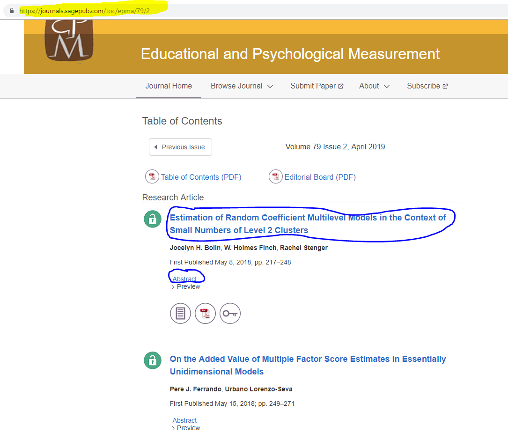
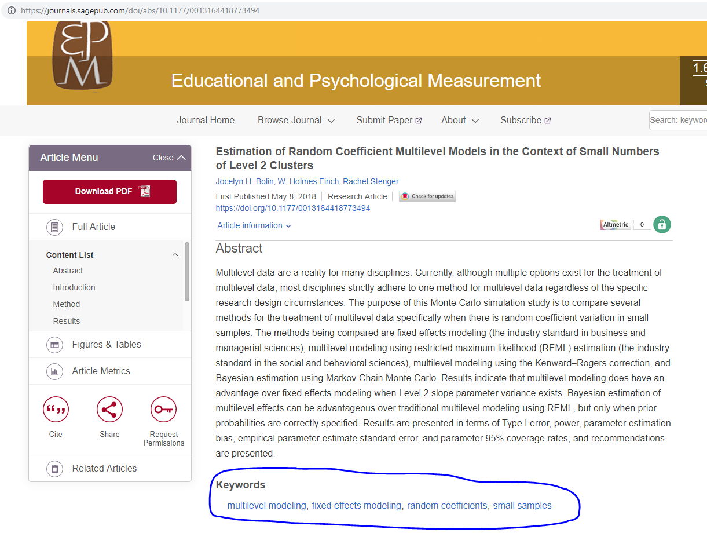
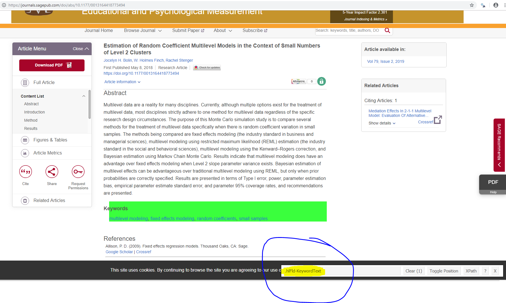

What are the most commonly used keywords in published articles in educational measurement journals? Is there any trending topic in educational measurement journals? I decided to do a sample analysis in the context of [Educational and Psychological Measurement (EPM)](https://journals.sagepub.com/home/epm). Initially, I was planning to do a comparison across journals including [Journal of Educational Measurement (JEM)](https://onlinelibrary.wiley.com/journal/17453984), [Applied Measurement in Education (AME)](https://www.tandfonline.com/loi/hame20/), and [Educational Measurement: Issues and Practices (EM:IP)](https://onlinelibrary.wiley.com/journal/17453992). However, I realized JEM and AME do not require keywords for the papers they publish. So, I focus on only EPM for now, and this can be replicated with a few tweaks in the code for EM:IP. This post will include some coding about how to automate scraping the desired information from the EPM webpage and I plan to write a follow-up post later with some analysis of the dataset compiled in this post.


```{r echo=TRUE, eval=TRUE}
require(rvest)
require(xml2)
require(knitr)
require(kableExtra)

```

## Scraping Keywords from the EPM Website

First, let's look at what information one needs to scrap from the EPM website and how this information is stored at the EPM website. Table of Contents for a certain volume and issue can be accessed using a link https://journals.sagepub.com/toc/epma/i/j, where i is the volume number and j is the issue number. For instance, if one wants to access Volume 79 Issue 2, the link is https://journals.sagepub.com/toc/epma/79/2. On this webpage, there is a list of titles for the papers published in this issue, and there is a link for **Abstract** under each title. At the link for **Abstract**, one can access the information about the title, authors, publication date, abstract, references, and keywords.



At the link for **Abstract**, one can access the information about the title, authors, publication date, abstract, references, and keywords for each paper.



Based on my exploration, EPM has been publishing keywords starting from Volume 63 and Issue 1 published in February 2003. That makes 98 issues published with keywords. If there is on average 10 articles published per issue, there may be about 1000 papers. One alternative is to extract this information manually one by one by visiting each paper published, which will probably take days and weeks. Therefore, it is wise to try to automate this process. 

### Step 1: Retrieving keywords for an article from an abstract link

For the example above, the link for the **Abstract** is https://journals.sagepub.com/doi/abs/10.1177/0013164418773494. Let's read this webpage into R.

```{r echo=TRUE, eval=TRUE}

link = "https://journals.sagepub.com/doi/abs/10.1177/0013164418773494"
article <- read_html(link)

article
```

The object **article** simply contains all html source code for this specific webpage. If you want to see it, you can check from this link 

view-source:https://journals.sagepub.com/doi/abs/10.1177/0013164418773494 

The information we are looking is somewhere in this source text, and the trick is how to pull that information. At this point, you would need some help from [SelectorGadget](https://selectorgadget.com/) app which can be installed as a Chrome extension. There is a good number of video tutorials on the web about how to use it, so I will skip that. When you open the SelectorGadget on the link for the paper and click the box where Keywords are listed, it will show you the CSS selector for that element. As can be seen in the screen shot below, we learn that the CSS selector for Keywords box in this page is ".hlFld-KeywordText".



Now, we can pull that specific piece from the whole html page we read to R before..

```{r echo=TRUE, eval=TRUE}

keywords <- html_text(html_nodes(article,".hlFld-KeywordText"))

keywords
```

It looks like we got what we want, but it needs some polishing. First, we need to get rid of the word "Keywords" at the beginning, transform each keyword separated by comma to different strings, and then delete the white spaces.


```{r echo=TRUE, eval=TRUE}

keywords  <- substring(keywords,10) 

keywords

keywords <- strsplit(keywords,",")[[1]]

keywords

keywords <- trimws(keywords)

keywords

```

Nice! So, given a link for a paper abstract, we just retrieved a vector of keywords for that specific paper. Below is a simple function to organize the code above. It takes an abstract link as input and returns the keywords on that link as an output.


```{r echo=TRUE, eval=TRUE}

key.words <- function(link){
  
  article  <- read_html(link)
  keywords <- html_text(html_nodes(article,".hlFld-KeywordText"))
  keywords <- substring(keywords,10)
  if(length(keywords)!=0){
    out      <- trimws(strsplit(keywords,",")[[1]])
  } else {
    out <- NULL
    }
  return(out)
  
}


link = "https://journals.sagepub.com/doi/abs/10.1177/0013164418773494"

key.words(link)

```


### Step 2: Retrieving abstract links fo papers published in an issue

The next important task is to extract the information about the abstract links for all papers published for an issue. As mentioned before, the table of contents for EPM issues follows the following format https://journals.sagepub.com/toc/epma/i/j. Suppose, we look at the latest issue https://journals.sagepub.com/toc/epma/79/2. If you select **Abstract** for any paper on this page using the SelectorGadget, it will show the CSS selector as ".abstract-link".

Let's look at what we can retrieve from this page using the ".abstract-link" node. 


```{r echo=TRUE, eval=TRUE}

link = "https://journals.sagepub.com/toc/epma/79/2"

issue <- read_html(link)


abstract.links <- html_attr(html_nodes(issue,".abstract-link"),"href")

abstract.links
```

This looks good! It shows there are 9 papers published in Volume 79 Issue 2, and these are the part of the links to access their abstract pages. 

All we need to do is to put "https://journals.sagepub.com/" in front of these texts.


```{r echo=TRUE, eval=TRUE}

abstract.links <- paste0("https://journals.sagepub.com",abstract.links)

abstract.links
```


Again, let's organize this code in a simple function. This function takes the volume number and issue number as numeric inputs, and then returns the list of abstract page links as a character vector.


```{r echo=TRUE, eval=TRUE}

doi <- function(volume,issue){
  
  link            <- paste0("https://journals.sagepub.com/toc/epma/",volume,"/",issue)
  issue           <- read_html(link)
  abstract.links  <- html_attr(html_nodes(issue,".abstract-link"),"href")
  out             <- paste0("https://journals.sagepub.com",abstract.links)
  
  return(out)
  
}


doi(volume=70,issue=3) # Returns the links for abstract pages from papers published in Volume 70 Issue 3

```


### Step 3: Retrieving all keywords published in an issue

After creating two functions in Step 1 and Step 2, this will be easier. Suppose we are looking at Volume 70 Issue 3. First, extract the links using the function in Step 2. Then, run a `for` loop to extract the keywords from each link using the function in Step 1. We will also organize them in a nice looking data frame.


```{r echo=TRUE, eval=TRUE}

i = 70  # volume number
j = 3   # issue number

doi.links <- doi(volume=i,issue=j) 

Keywords <- data.frame(article=NULL,keywords=NULL)

for(r in 1:length(doi.links)){
  
  link     <- doi.links[r]
  keywords <- key.words(link)
  if(is.null(keywords)==FALSE){
    sub.data <- data.frame(article=r,keywords=keywords)
    Keywords <- rbind(Keywords,sub.data)
  }
}

Keywords$volume <- i
Keywords$issue  <- j


kable(Keywords,format="html",row.names=FALSE,align="cccc")

```


Let's also organize this in a single function. This function takes the volume number and issue number as numeric inputs, and then returns the keywords published in that issue.

```{r echo=TRUE, eval=TRUE}

extract.Keywords <- function(i,j){
  
doi.links <- doi(volume=i,issue=j) 

Keywords <- data.frame(article=NULL,keywords=NULL)

for(r in 1:length(doi.links)){
  
  link     <- doi.links[r]
  keywords <- key.words(link)
  if(is.null(keywords)==FALSE){
    sub.data <- data.frame(article=r,keywords=keywords)
    Keywords <- rbind(Keywords,sub.data)
  }
}

  Keywords$volume <- i
  Keywords$issue  <- j

  return(Keywords)
}

extract.Keywords(i=70,j=3)

```

### Step 4: Retrieving all keywords published since 2003

As mentioned at the beginning, EPM has been publishing keywords starting from Volume 63 and Issue 1 published in February 2003. Also, each volume has six issues since then.

Now, let's create a data frame for the volume and issue information since 2003. 

```{r echo=TRUE, eval=TRUE}

EPM.issues <- expand.grid(volume=63:79,issue=1:6)

# Add year as a column

EPM.issues$year <- 2003:2019
EPM.issues <- EPM.issues[order(EPM.issues$volume),]

# The last four rows are not published yet.


EPM.issues <- EPM.issues[1:98,]

EPM.issues

```


Now, I will use a `for` loop to run `extract.Keywords()` function from Step 3 for every issue of EPM, and compile them in one data frame. Note that this took about an hour to run, so be patient if you are replicating this. 


```{r echo=TRUE, eval=FALSE}

all.Keywords <- c()

for(rep in 1:nrow(EPM.issues)){

  key      <- extract.Keywords(i=EPM.issues[rep,]$volume,
                          j=EPM.issues[rep,]$issue)

  key$year <- EPM.issues[rep,]$year
  
  all.Keywords <- rbind(all.Keywords,key)
}


```

The dataset obtained from the code above can be downloaded from [this link](data/all.Keywords.csv). This includes a total of 4,061 keywords from 901 published articles published in 98 issues since February 2003. Now, we can dive into this dataset and see what it reveals!


