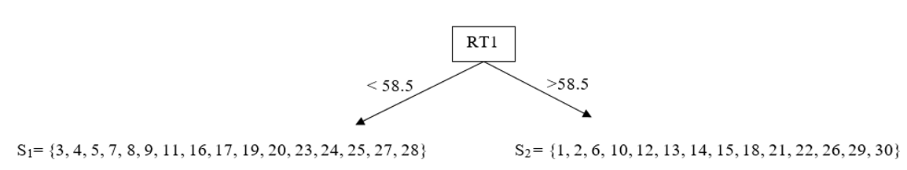
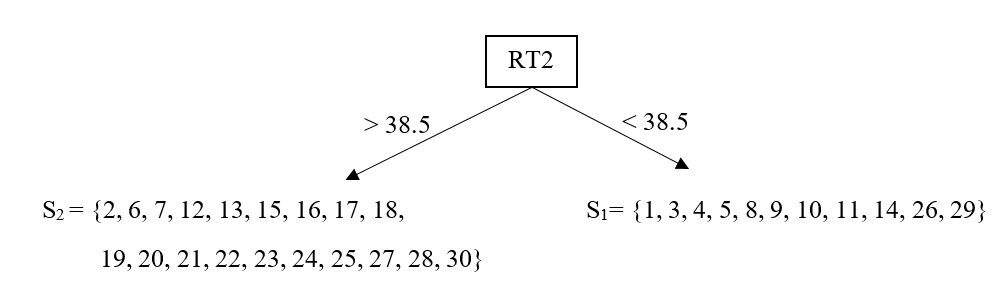
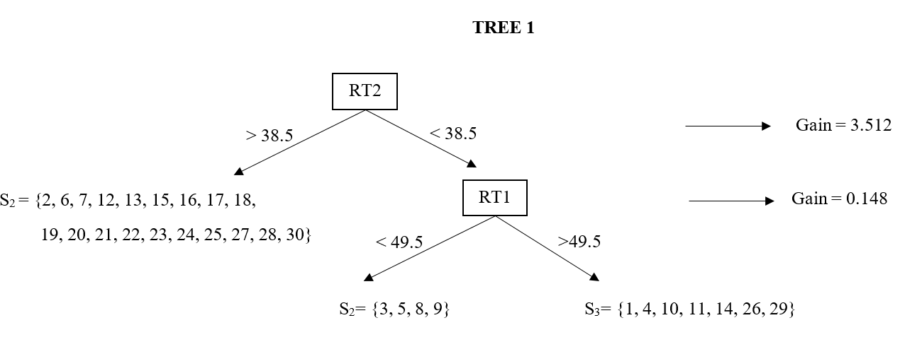
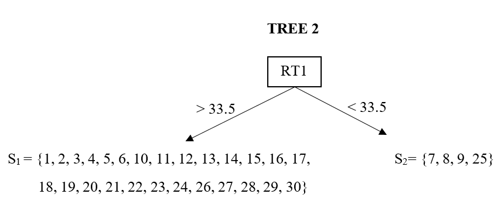
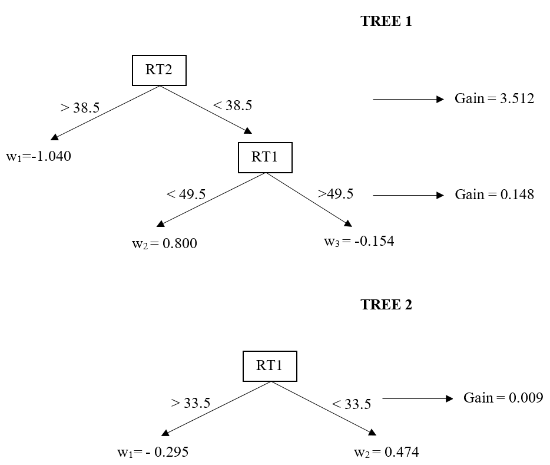
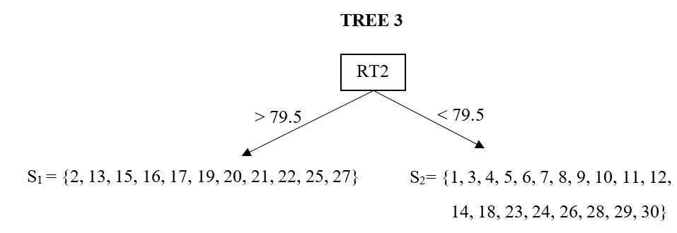
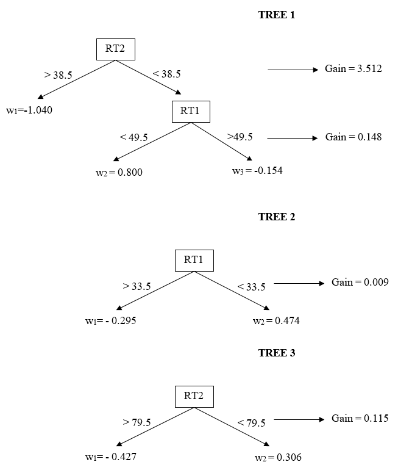

In one of the working papers under review, I am using the [Extreme Gradient Boosting (XGBoost)](https://github.com/dmlc/xgboost) to identify examinees with potential item preknowledge in a certification exam. In the first draft I submitted, I did not talk much about the technical aspects of XGBoost and went straight to my application. However, one of the reviewers asked more description of the XGBoost to help readers get a conceptual understanding of how XGBoost works.

After spending a few weeks and going over the [original XGBoost paper](https://dl.acm.org/citation.cfm?id=2939785) and [this presentation](https://homes.cs.washington.edu/~tqchen/pdf/BoostedTree.pdf) so many times, I finally felt that I had a good grasp of it. Then, I came up with a small numerical illustration in the context of the problem I am working on. Here, I provide an informal introduction of this illustration with accompanying R code, so that anyone can play with it.

You can download the illustration dataset from this [link.](data/illustration2.csv)

## Dataset

Suppose, we have 30 observations with three variables, $RT_1$, $RT_2$, and $y$. $RT_1$ and $RT_2$ are the response time (in seconds) for two test items and our features (predictors). $y$ is a binary outcome variable with 0 indicating that the individual did not have item preknowledge and 1 indicating that the individual had item preknowledge. The goal is to develop a tree ensemble model to predict the outcome given the feature variables.

```{r echo=TRUE, eval=TRUE}
d <- read.csv("data/illustration2.csv")
d$Obs <- 1:30
d <- d[,c(4,1,2,3)]

require(knitr)
require(kableExtra)

t = kable(d,digits=1,row.names=FALSE)
column_spec(t,column=1:4,width="1em")
```

First, we need an objective function to optimize. So, we can look back and check if we are improving our model. In the context of predicting a binary outcome, XGBoost is using a logistic loss function.

$$\ell(y_i,\hat{y}_i)=y_i ln(1+e^{-\hat{y}_i})+(1-y_i)ln(1+e^{\hat{y}_i}),$$

where $y_i$ and $\hat{y}_i$ are the observed and predicted outcome for the $i^{th}$ observation. Before we start iterations, XGBoost assigns a predicted value of 0 for each observation as our initial prediction. Let's call this Iteration 0. 

```{r echo=TRUE, eval=TRUE}
d$y0 <- 0
colnames(d)[5] <- "$\\hat{y}^0$"
  
t = kable(d,digits=1,row.names=FALSE)
column_spec(t,column=1:5,width="1em")
```

The value of the loss function based on $y_i$ and $\hat{y}^0$ at Iteration 0 is 20.79442.

```{r echo=TRUE, eval=TRUE}
y  <- d[,4]
y0 <- d[,5]

loss0 <- sum(y*log(1+exp(-y0)) + (1-y)*log(1+exp(y0)))
loss0
```

## Iteration 1

To build the first tree, we need the first and second order gradient statistics of the loss function from Iteration 0. Chen and Guestrin (2016) used a second-order Taylor approximation for the loss function and derived the equations for the first- and second-order gradient statistics. In this case, we can compute the first- and second-order gradient statistics for each observation as the following:

$$g_i^{(1)} = -\frac{(y_i-1)e^{\hat{y_i}^{(0)}}+y_i}{e^{\hat{y_i}^{(0)}}+1}$$

$$h_i^{(1)} = \frac{e^{\hat{y_i}^{(0)}}}{(e^{\hat{y_i}^{(0)}}+1)^2}$$
```{r echo=TRUE, eval=TRUE}
d$g1 <- -((y-1)*exp(y0)+y)/(exp(y0)+1)
d$h1 <- exp(y0)/((exp(y0)+1)^2)

t = kable(d,digits=1,row.names=FALSE)
column_spec(t,column=1:7,width="1em") %>%
add_header_above(c(" "," "," "," "," ","Iteration 1" = 2))
```


Now the tricky part here is to find the best split of these observations that would improve the predictions most (reduce the value of loss function most). The observations can be split based on the RT1 or RT2 features. For instance, suppose we divide the observations into two groups based on whether the RT1 value is below or above 58.5 seconds. Below is a hypothetical tree structure with two leaves. There are 16 observations in the first leaf ($S_1$), and 14 observations in the second leaf ($S_2$).



There are many potential splits available. We can say the number of possible theoretical splits are $2^{30}$. However, most of them are not relevant here. In this case, there are only 53 possible splits of interest, 27 based on RT1 and 26 based on RT2 (as many as the number of unique elements for RT1 and RT2). 

So, how could we know if this particular split is good or bad? Or, how could we know the best split that would improve our predictions most? To evaluate a tree structure like this, we need a quantity to measure its quality. Chen and Guestrin (2016) derived the Gain score for evaluating a fixed tree structure.

$$
Gain = \left [  
\sum_{l=1}^{L}
\left ( \frac{\sum_{i \epsilon S_l}g_i)^2}{\sum_{i \epsilon S_l}h_i+\lambda} - 
\frac{(\sum_{i}g_i)^2}{\sum_{i}h_i+\lambda} \right )
\right ]-\gamma
$$

Here, $l$ indexes the leaf, $L$ is the number of leaves in the tree structure, and $S_l$ indicates the set of observations in the $l^{th}$ leaf. $\lambda$ and $\gamma$ are the parameters to penalize the complexity of the tree structure and should be set to specific values. In practice, these values are typically determined through a parameter tuning procedure. For the sake of this illustration, I set the values to 1.5 and 1 for  $\lambda$ and $\gamma$, respectively.

Now, we will compute the gain score for each possible split based on the RT1 and RT2 features, and then check which one gives the best solution. 


```{r echo=TRUE, eval=TRUE}

g <- d$g1
h <- d$h1

lambda = 1.5
gamma = 1

# All Splits based on RT1

gain <- c()
s <- sort(unique(d$RT1))+.5

for(i in 1:length(s)) {
  
  split  <- (d$RT1<s[i])*1
  GL     <- sum(g[which(split==1)])
  GR     <- sum(g[which(split==0)])
  HL     <- sum(h[which(split==1)])
  HR     <- sum(h[which(split==0)])
  
  gain[i]  <- ((GL^2/(HL+lambda)) + (GR^2/(HR+lambda)) - (((GL+GR)^2)/(HL+HR+lambda))) - gamma
}

pp1 = cbind(as.data.frame(cbind(s,gain)),"RT1")
colnames(pp1) <- c("Threshold","Gain","Feature")

# All Splits for RT2

gain <- c()
s <- sort(unique(d$RT2))+.5

for(i in 1:length(s)) {
  
  split <- (d$RT2<s[i])*1
  GL     <- sum(g[which(split==1)])
  GR     <- sum(g[which(split==0)])
  HL     <- sum(h[which(split==1)])
  HR     <- sum(h[which(split==0)])
  
  gain[i]  <- ((GL^2/(HL+lambda)) + (GR^2/(HR+lambda)) - (((GL+GR)^2)/(HL+HR+lambda))) - gamma
}

pp2 = cbind(as.data.frame(cbind(s,gain)),"RT2")
colnames(pp2) <- c("Threshold","Gain","Feature")

pp <- rbind(pp1,pp2)
pp <- pp[order(pp$Gain,decreasing=TRUE),]

kable(head(pp),digits=3,row.names=FALSE)

```

As we can see, the split with the largest gain is the one based on a threshold level of 38.5 for the RT2 feature. So, the first branch of the first tree is developed. 



The algorithm will be repeated for the observations on each leaf. The algorithm will compute a gain score for all potential splits on each leaf separately to see if there is a new branch with a positive gain that can be added to any of the two leaves (or to both leaves). Let's first look at all potential splits on the first leaf (RT2 < 38.5).


```{r echo=TRUE, eval=TRUE}

# All RT1 Splits on Leaf 1

	gain  <- c()
	s     <- sort(d[d$RT2<38.5,]$RT1)+.5

	for(i in 1:length(s)) {

	   gr1 <- which(d$RT2<38.5 & d$RT1<s[i])
     gr2 <- which(d$RT2<38.5 & d$RT1>s[i])

	   GL     <- sum(g[gr1])
	   GR     <- sum(g[gr2])
	   HL     <- sum(h[gr1])
	   HR     <- sum(h[gr2])
	   gain[i] <- ((GL^2/(HL+lambda)) + (GR^2/(HR+lambda)) - (((GL+GR)^2)/(HL+HR+lambda))) - gamma            
	}

	pp1 = cbind(as.data.frame(cbind(s,gain)),"RT1")
	colnames(pp1) <- c("Threshold","Gain","Feature")


# All RT2 Splits on Leaf 1

	gain  <- c()
	s     <- sort(d[d$RT2<38.5,]$RT2)+.5

	for(i in 1:length(s)) {

	   gr1 <- which(d$RT2<38.5 & d$RT2<s[i])
     gr2 <- which(d$RT2<38.5 & d$RT2>s[i])

	   GL     <- sum(g[gr1])
	   GR     <- sum(g[gr2])
	   HL     <- sum(h[gr1])
	   HR     <- sum(h[gr2])
	   gain[i] <- ((GL^2/(HL+lambda)) + (GR^2/(HR+lambda)) - (((GL+GR)^2)/(HL+HR+lambda))) - gamma            
	}

	pp2 = cbind(as.data.frame(cbind(s,gain)),"RT1")
	colnames(pp2) <- c("Threshold","Gain","Feature")


	pp <- rbind(pp1,pp2)
  pp <- pp[order(pp$Gain,decreasing=TRUE),]

  kable(head(pp),digits=3,row.names=FALSE)
```

The results indicate that there is only one potential split with a positive gain, a split based on a threshold level of 49.5 for the RT1 feature. Now, let's check all potential splits on the second leaf (RT2 > 38.5).

```{r echo=TRUE, eval=TRUE}

# All RT1 Splits on Leaf 2

	gain  <- c()
	s     <- sort(d[d$RT2>38.5,]$RT1)+.5

	for(i in 1:length(s)) {

	   gr1 <- which(d$RT2>38.5 & d$RT1<s[i])
     gr2 <- which(d$RT2>38.5 & d$RT1>s[i])

	   GL     <- sum(g[gr1])
	   GR     <- sum(g[gr2])
	   HL     <- sum(h[gr1])
	   HR     <- sum(h[gr2])
	   gain[i] <- ((GL^2/(HL+lambda)) + (GR^2/(HR+lambda)) - (((GL+GR)^2)/(HL+HR+lambda))) - gamma            
	}

	pp1 = cbind(as.data.frame(cbind(s,gain)),"RT1")
	colnames(pp1) <- c("Threshold","Gain","Feature")


# All RT2 Splits on Leaf 2

	gain  <- c()
	s     <- sort(d[d$RT2>38.5,]$RT2)+.5

	for(i in 1:length(s)) {

	   gr1 <- which(d$RT2>38.5 & d$RT2<s[i])
     gr2 <- which(d$RT2>38.5 & d$RT2>s[i])

	   GL     <- sum(g[gr1])
	   GR     <- sum(g[gr2])
	   HL     <- sum(h[gr1])
	   HR     <- sum(h[gr2])
	   gain[i] <- ((GL^2/(HL+lambda)) + (GR^2/(HR+lambda)) - (((GL+GR)^2)/(HL+HR+lambda))) - gamma            
	}

	pp2 = cbind(as.data.frame(cbind(s,gain)),"RT1")
	colnames(pp2) <- c("Threshold","Gain","Feature")


	pp <- rbind(pp1,pp2)
  pp <- pp[order(pp$Gain,decreasing=TRUE),]

  kable(head(pp),digits=3,row.names=FALSE)
```

It seems none of the possible splits on the second leaf yield a positive gain score. In this case, the search algorithm suggests adding a new branch on the first leaf based on a threshold level of 49.5 for the RT1 feature. Our first tree structure now looks like this.



The depth of our tree is now 2. As you can imagine, we can continue to search, and add even more branches to the tree by picking the best split as long as there is a positive gain. This would increase the depth of the tree. The more depth a tree structure has, the more complex interactions it accounts for when predicting the outcome. For the sake of this illustration, we stop and end Iteration 1 here.

Once, the tree structure is determined, we can now compute the weights for each leaf. Our first tree structure has three leaves now. Chen and Guestrin (2016) derived that the optimal leaf weight for a fixed tree structure is equal to

$$w_l=- \frac{\sum_{i \epsilon S_l}g_i}{\sum_{i \epsilon S_l}h_i+\lambda}$$

Let's compute the leaf weights on the first tree structure.

```{r echo=TRUE, eval=TRUE}

  gr1 <- which(d$RT2 > 38.5)
  gr1
  
  gr2 <- which(d$RT2 <38.5 & d$RT1<49.5)
  gr2
  
  gr3 <- which(d$RT2 <38.5 & d$RT1>49.5)
  gr3


		w1 = -sum(g[gr1])/(sum(h[gr1])+lambda)
		w2 = -sum(g[gr2])/(sum(h[gr2])+lambda)
		w3 = -sum(g[gr3])/(sum(h[gr3])+lambda)
		
		w1
		w2
		w3
		
```

These weights represent how we will improve our predictions at the end of Iteration 1 before we move on to Iteration 2. Each observation in our dataset is now assigned to one of these weights depending on which leaf they belong to. In the end, we add these estimated leaf weights to the previous predictions ($\hat{y}^0$) and obtain the new predictions at the end of Iteration 1 ($\hat{y}^1$).

```{r echo=TRUE, eval=TRUE}

 d$w  <- NA
 d$y1 <- NA
 
 d[gr1,]$w = w1
 d[gr2,]$w = w2
 d[gr3,]$w = w3
 
 d$y1 <- d[,5] + d$w
 
 colnames(d)[8] <- "$w^{1}$"
 colnames(d)[9] <- "$\\hat{y}^1$"
   
   
t = kable(d,digits=3,row.names=FALSE)
column_spec(t,column=1:7,width="1em") %>%
add_header_above(c(" "," "," "," "," ","Iteration 1" = 4))
```

The value of the loss function based on $y_i$ and $\hat{y}^1$ at the end of Iteration 1 is 15.15 (reduced from 20.79)

```{r echo=TRUE, eval=TRUE}
y  <- d[,4]
y1 <- d[,9]

loss1 <- sum(y*log(1+exp(-y1)) + (1-y)*log(1+exp(y1)))
loss1
```

## Iteration 2

The remaining of this analysis is simply a repetition of Iteration 1. At the end of Iteration 1, we developed the first tree in our model. Now, we will develop the second one. First, we have to update our first- and second-order gradient statistics based on the new predictions at the end of Iteration 1.

$$g_i^{(2)} = -\frac{(y_i-1)e^{\hat{y_i}^{(1)}}+y_i}{e^{\hat{y_i}^{(1)}}+1}$$

$$h_i^{(2)} = \frac{e^{\hat{y_i}^{(1)}}}{(e^{\hat{y_i}^{(1)}}+1)^2}$$

```{r echo=TRUE, eval=TRUE}

d$g2 <- -((y-1)*exp(y1)+y)/(exp(y1)+1)
d$h2 <- exp(y1)/((exp(y1)+1)^2)

t = kable(d,digits=3,row.names=FALSE)
column_spec(t,column=1:7,width="1em") %>%
add_header_above(c(" "," "," "," "," ","Iteration 1" = 4, "Iteration 2" = 2))
```

The algorithm computes the same search as in the Iteration 1 for all possible splits based on the RT1 and RT2 features using the updated gradient statistics.

```{r echo=TRUE, eval=TRUE}

g <- d$g2
h <- d$h2

# All Splits based on RT1

gain <- c()
s <- sort(unique(d$RT1))+.5

for(i in 1:length(s)) {
  
  split  <- (d$RT1<s[i])*1
  GL     <- sum(g[which(split==1)])
  GR     <- sum(g[which(split==0)])
  HL     <- sum(h[which(split==1)])
  HR     <- sum(h[which(split==0)])
  
  gain[i]  <- ((GL^2/(HL+lambda)) + (GR^2/(HR+lambda)) - (((GL+GR)^2)/(HL+HR+lambda))) - gamma
}

pp1 = cbind(as.data.frame(cbind(s,gain)),"RT1")
colnames(pp1) <- c("Threshold","Gain","Feature")

# All Splits for RT2

gain <- c()
s <- sort(unique(d$RT2))+.5

for(i in 1:length(s)) {
  
  split <- (d$RT2<s[i])*1
  GL     <- sum(g[which(split==1)])
  GR     <- sum(g[which(split==0)])
  HL     <- sum(h[which(split==1)])
  HR     <- sum(h[which(split==0)])
  
  gain[i]  <- ((GL^2/(HL+lambda)) + (GR^2/(HR+lambda)) - (((GL+GR)^2)/(HL+HR+lambda))) - gamma
}

pp2 = cbind(as.data.frame(cbind(s,gain)),"RT2")
colnames(pp2) <- c("Threshold","Gain","Feature")

pp <- rbind(pp1,pp2)
pp <- pp[order(pp$Gain,decreasing=TRUE),]

kable(head(pp),digits=3,row.names=FALSE)

```

It seems the best split for the first branch of the second tree is based on a threshold value of 33.5 for the RT1 feature.



Similar to Iteration 1, the algorithm will compute a gain score for all potential splits on each leaf of the second tree to see if there is a new branch with a positive gain that can be added to any of the two leaves (or to both leaves).

Let's first look at all potential splits on the first leaf (RT1 > 33.5).


```{r echo=TRUE, eval=TRUE}

# All RT1 Splits on Leaf 1

	gain  <- c()
	s     <- sort(d[d$RT1>33.5,]$RT1)+.5

	for(i in 1:length(s)) {

	   gr1 <- which(d$RT1>33.5 & d$RT1<s[i])
     gr2 <- which(d$RT1>33.5 & d$RT1>s[i])

	   GL     <- sum(g[gr1])
	   GR     <- sum(g[gr2])
	   HL     <- sum(h[gr1])
	   HR     <- sum(h[gr2])
	   gain[i] <- ((GL^2/(HL+lambda)) + (GR^2/(HR+lambda)) - (((GL+GR)^2)/(HL+HR+lambda))) - gamma            
	}

	pp1 = cbind(as.data.frame(cbind(s,gain)),"RT1")
	colnames(pp1) <- c("Threshold","Gain","Feature")


# All RT2 Splits on Leaf 1

	gain  <- c()
	s     <- sort(d[d$RT1>33.5,]$RT2)+.5

	for(i in 1:length(s)) {

	   gr1 <- which(d$RT1>33.5 & d$RT2<s[i])
     gr2 <- which(d$RT1>33.5 & d$RT2>s[i])

	   GL     <- sum(g[gr1])
	   GR     <- sum(g[gr2])
	   HL     <- sum(h[gr1])
	   HR     <- sum(h[gr2])
	   gain[i] <- ((GL^2/(HL+lambda)) + (GR^2/(HR+lambda)) - (((GL+GR)^2)/(HL+HR+lambda))) - gamma            
	}

	pp2 = cbind(as.data.frame(cbind(s,gain)),"RT1")
	colnames(pp2) <- c("Threshold","Gain","Feature")


	pp <- rbind(pp1,pp2)
  pp <- pp[order(pp$Gain,decreasing=TRUE),]

  kable(head(pp),digits=3,row.names=FALSE)
```

The results indicate that there is no split with a positive gain that can be added to the first leaf. Let's check the second leaf  (RT1 < 33.5).

```{r echo=TRUE, eval=TRUE}

# All RT1 Splits on Leaf 2

	gain  <- c()
	s     <- sort(d[d$RT1<33.5,]$RT1)+.5

	for(i in 1:length(s)) {

	   gr1 <- which(d$RT1<33.5 & d$RT1<s[i])
     gr2 <- which(d$RT1<33.5 & d$RT1>s[i])

	   GL     <- sum(g[gr1])
	   GR     <- sum(g[gr2])
	   HL     <- sum(h[gr1])
	   HR     <- sum(h[gr2])
	   gain[i] <- ((GL^2/(HL+lambda)) + (GR^2/(HR+lambda)) - (((GL+GR)^2)/(HL+HR+lambda))) - gamma            
	}

	pp1 = cbind(as.data.frame(cbind(s,gain)),"RT1")
	colnames(pp1) <- c("Threshold","Gain","Feature")


# All RT2 Splits on Leaf 2

	gain  <- c()
	s     <- sort(d[d$RT1<33.5,]$RT2)+.5

	for(i in 1:length(s)) {

	   gr1 <- which(d$RT1<33.5 & d$RT2<s[i])
     gr2 <- which(d$RT1<33.5 & d$RT2>s[i])

	   GL     <- sum(g[gr1])
	   GR     <- sum(g[gr2])
	   HL     <- sum(h[gr1])
	   HR     <- sum(h[gr2])
	   gain[i] <- ((GL^2/(HL+lambda)) + (GR^2/(HR+lambda)) - (((GL+GR)^2)/(HL+HR+lambda))) - gamma            
	}

	pp2 = cbind(as.data.frame(cbind(s,gain)),"RT1")
	colnames(pp2) <- c("Threshold","Gain","Feature")


	pp <- rbind(pp1,pp2)
  pp <- pp[order(pp$Gain,decreasing=TRUE),]

  kable(head(pp),digits=3,row.names=FALSE)
```

There is also no split with a positive gain that can be added to the second leaf. Therefore, we stop and Iteration 2 ends. Our second tree has a depth of one. Let's compute the leaf weights on the second tree structure.

```{r echo=TRUE, eval=TRUE}
gr1 <- which(d$RT1 > 33.5)
gr2 <- which(d$RT1 < 33.5)

w1 = -sum(g[gr1])/(sum(h[gr1])+lambda)
w2 = -sum(g[gr2])/(sum(h[gr2])+lambda)

w1
w2
```

These weights similarly represent how we will improve our predictions at the end of Iteration 2 before we move on to Iteration 3. Each observation in our dataset is now assigned to one of these weights depending on which leaf they belong to in Tree 2. In the end, we add these estimated leaf weights to the previous predictions ($\hat{y}^1$) and obtain the new predictions at the end of Iteration 2 ($\hat{y}^2$).

```{r echo=TRUE, eval=TRUE}

 d$w  <- NA
 d$y2 <- NA
 
 d[gr1,]$w = w1
 d[gr2,]$w = w2
 
 d$y2 <- d[,9] + d$w
 
 colnames(d)[12] <- "$w^{2}$"
 colnames(d)[13] <- "$\\hat{y}^2$"
   
   
t = kable(d,digits=3,row.names=FALSE)
column_spec(t,column=1:7,width="1em") %>%
add_header_above(c(" "," "," "," "," ","Iteration 1" = 4, "Iteration 2" = 4))
```

The value of the loss function based on $y_i$ and $\hat{y}^2$ at the end of Iteration 2 is 14.35 (reduced from 15.15).

```{r echo=TRUE, eval=TRUE}
y  <- d[,4]
y2 <- d[,13]

loss2 <- sum(y*log(1+exp(-y2)) + (1-y)*log(1+exp(y2)))
loss2
```

Our tree ensemble model at the end of Iteration 2 now looks like this.




## Iteration 3

We keep repeating the same cycle. First, we update our first- and second-order gradient statistics based on the new predictions at the end of Iteration 2.

$$g_i^{(3)} = -\frac{(y_i-1)e^{\hat{y_i}^{(2)}}+y_i}{e^{\hat{y_i}^{(2)}}+1}$$

$$h_i^{(3)} = \frac{e^{\hat{y_i}^{(2)}}}{(e^{\hat{y_i}^{(2)}}+1)^2}$$

```{r echo=TRUE, eval=TRUE}

d$g3 <- -((y-1)*exp(y2)+y)/(exp(y2)+1)
d$h3 <- exp(y2)/((exp(y2)+1)^2)

t = kable(d,digits=3,row.names=FALSE)
column_spec(t,column=1:7,width="1em") %>%
add_header_above(c(" "," "," "," "," ","Iteration 1" = 4, "Iteration 2" = 4, "Iteration 3" = 2))
```

The algorithm searches among all possible splits based on the RT1 and RT2 features using the updated gradient statistics.

```{r echo=TRUE, eval=TRUE}

g <- d$g3
h <- d$h3

# All Splits based on RT1

gain <- c()
s <- sort(unique(d$RT1))+.5

for(i in 1:length(s)) {
  
  split  <- (d$RT1<s[i])*1
  GL     <- sum(g[which(split==1)])
  GR     <- sum(g[which(split==0)])
  HL     <- sum(h[which(split==1)])
  HR     <- sum(h[which(split==0)])
  
  gain[i]  <- ((GL^2/(HL+lambda)) + (GR^2/(HR+lambda)) - (((GL+GR)^2)/(HL+HR+lambda))) - gamma
}

pp1 = cbind(as.data.frame(cbind(s,gain)),"RT1")
colnames(pp1) <- c("Threshold","Gain","Feature")

# All Splits for RT2

gain <- c()
s <- sort(unique(d$RT2))+.5

for(i in 1:length(s)) {
  
  split <- (d$RT2<s[i])*1
  GL     <- sum(g[which(split==1)])
  GR     <- sum(g[which(split==0)])
  HL     <- sum(h[which(split==1)])
  HR     <- sum(h[which(split==0)])
  
  gain[i]  <- ((GL^2/(HL+lambda)) + (GR^2/(HR+lambda)) - (((GL+GR)^2)/(HL+HR+lambda))) - gamma
}

pp2 = cbind(as.data.frame(cbind(s,gain)),"RT2")
colnames(pp2) <- c("Threshold","Gain","Feature")

pp <- rbind(pp1,pp2)
pp <- pp[order(pp$Gain,decreasing=TRUE),]

kable(head(pp),digits=3,row.names=FALSE)

```

The best split was found based on a threshold value of 79..5 for the RT2 feature.



The algorithm computes a gain score for all potential splits on each leaf of the third tree to see if there is a new branch with a positive gain that can be added to any of the two leaves (or to both leaves).

Let's first look at all potential splits on the first leaf (RT2 > 79.5).


```{r echo=TRUE, eval=TRUE}

# All RT1 Splits on Leaf 1

	gain  <- c()
	s     <- sort(d[d$RT2>79.5,]$RT1)+.5

	for(i in 1:length(s)) {

	   gr1 <- which(d$RT2>79.5 & d$RT1<s[i])
     gr2 <- which(d$RT2>79.5 & d$RT1>s[i])

	   GL     <- sum(g[gr1])
	   GR     <- sum(g[gr2])
	   HL     <- sum(h[gr1])
	   HR     <- sum(h[gr2])
	   gain[i] <- ((GL^2/(HL+lambda)) + (GR^2/(HR+lambda)) - (((GL+GR)^2)/(HL+HR+lambda))) - gamma            
	}

	pp1 = cbind(as.data.frame(cbind(s,gain)),"RT1")
	colnames(pp1) <- c("Threshold","Gain","Feature")


# All RT2 Splits on Leaf 1

	gain  <- c()
	s     <- sort(d[d$RT2>79.5,]$RT2)+.5

	for(i in 1:length(s)) {

	   gr1 <- which(d$RT2>79.5 & d$RT2<s[i])
     gr2 <- which(d$RT2>79.5 & d$RT2>s[i])

	   GL     <- sum(g[gr1])
	   GR     <- sum(g[gr2])
	   HL     <- sum(h[gr1])
	   HR     <- sum(h[gr2])
	   gain[i] <- ((GL^2/(HL+lambda)) + (GR^2/(HR+lambda)) - (((GL+GR)^2)/(HL+HR+lambda))) - gamma            
	}

	pp2 = cbind(as.data.frame(cbind(s,gain)),"RT1")
	colnames(pp2) <- c("Threshold","Gain","Feature")


	pp <- rbind(pp1,pp2)
  pp <- pp[order(pp$Gain,decreasing=TRUE),]

  kable(head(pp),digits=3,row.names=FALSE)
```

The results indicate that there is no split with a positive gain that can be added to the first leaf. Let's check the second leaf  (RT2 < 79.5).

```{r echo=TRUE, eval=TRUE}

# All RT1 Splits on Leaf 2

	gain  <- c()
	s     <- sort(d[d$RT2<79.5,]$RT1)+.5

	for(i in 1:length(s)) {

	   gr1 <- which(d$RT2<79.5 & d$RT1<s[i])
     gr2 <- which(d$RT2<79.5 & d$RT1>s[i])

	   GL     <- sum(g[gr1])
	   GR     <- sum(g[gr2])
	   HL     <- sum(h[gr1])
	   HR     <- sum(h[gr2])
	   gain[i] <- ((GL^2/(HL+lambda)) + (GR^2/(HR+lambda)) - (((GL+GR)^2)/(HL+HR+lambda))) - gamma            
	}

	pp1 = cbind(as.data.frame(cbind(s,gain)),"RT1")
	colnames(pp1) <- c("Threshold","Gain","Feature")


# All RT2 Splits on Leaf 2

	gain  <- c()
	s     <- sort(d[d$RT2<79.5,]$RT2)+.5

	for(i in 1:length(s)) {

	   gr1 <- which(d$RT2<79.5 & d$RT2<s[i])
     gr2 <- which(d$RT2<79.5 & d$RT2>s[i])

	   GL     <- sum(g[gr1])
	   GR     <- sum(g[gr2])
	   HL     <- sum(h[gr1])
	   HR     <- sum(h[gr2])
	   gain[i] <- ((GL^2/(HL+lambda)) + (GR^2/(HR+lambda)) - (((GL+GR)^2)/(HL+HR+lambda))) - gamma            
	}

	pp2 = cbind(as.data.frame(cbind(s,gain)),"RT1")
	colnames(pp2) <- c("Threshold","Gain","Feature")


	pp <- rbind(pp1,pp2)
  pp <- pp[order(pp$Gain,decreasing=TRUE),]

  kable(head(pp),digits=3,row.names=FALSE)
```

There is also no split with a positive gain that can be added to the second leaf. Therefore, we stop and Iteration 3 ends. Our third tree has a depth of one as the second tree. Let's compute the leaf weights on the third tree structure.

```{r echo=TRUE, eval=TRUE}

gr1 <- which(d$RT2 > 79.5)
gr2 <- which(d$RT2 < 79.5)

w1 = -sum(g[gr1])/(sum(h[gr1])+lambda)
w2 = -sum(g[gr2])/(sum(h[gr2])+lambda)

w1
w2
```

We use these weights to update the predictions at the end of Iteration 3 before we move on to Iteration 4. Each observation in our dataset is assigned to one of these weights depending on which leaf they belong to in Tree 3. Then, we add these estimated leaf weights to the previous predictions ($\hat{y}^2$) and obtain the new predictions at the end of Iteration 3 ($\hat{y}^3$).

```{r echo=TRUE, eval=TRUE}

 d$w  <- NA
 d$y3 <- NA
 
 d[gr1,]$w = w1
 d[gr2,]$w = w2
 
 d$y3 <- d[,13] + d$w
 
 colnames(d)[16] <- "$w^{3}$"
 colnames(d)[17] <- "$\\hat{y}^3$"
   
   
t = kable(d,digits=3,row.names=FALSE)
column_spec(t,column=1:7,width="1em") %>%
add_header_above(c(" "," "," "," "," ","Iteration 1" = 4, "Iteration 2" = 4, "Iteration 3" = 4))
```

The value of the loss function based on $y_i$ and $\hat{y}^3$ at the end of Iteration 3 is 13.57 (reduced from 14.35).

```{r echo=TRUE, eval=TRUE}
y  <- d[,4]
y3 <- d[,17]

loss3 <- sum(y*log(1+exp(-y3)) + (1-y)*log(1+exp(y3)))
loss3
```

Our tree ensemble model at the end of Iteration 3  looks like this.





## Iteration 4

We update our first- and second-order gradient statistics based on the new predictions at the end of Iteration 3. As can be seen below, the search process did not find any split with a positive gain score. Therefore, the whole search process ended because there is no fourth tree structure that can be added with an improvement in our predictions. So, our final model remains the structure at the end of Iteration 3.

$$g_i^{(4)} = -\frac{(y_i-1)e^{\hat{y_i}^{(3)}}+y_i}{e^{\hat{y_i}^{(3)}}+1}$$

$$h_i^{(4)} = \frac{e^{\hat{y_i}^{(3)}}}{(e^{\hat{y_i}^{(3)}}+1)^2}$$

```{r echo=TRUE, eval=TRUE}

d$g4 <- -((y-1)*exp(y3)+y)/(exp(y3)+1)
d$h4 <- exp(y3)/((exp(y3)+1)^2)

g <- d$g4
h <- d$h4

# All Splits based on RT1

gain <- c()
s <- sort(unique(d$RT1))+.5

for(i in 1:length(s)) {
  
  split  <- (d$RT1<s[i])*1
  GL     <- sum(g[which(split==1)])
  GR     <- sum(g[which(split==0)])
  HL     <- sum(h[which(split==1)])
  HR     <- sum(h[which(split==0)])
  
  gain[i]  <- ((GL^2/(HL+lambda)) + (GR^2/(HR+lambda)) - (((GL+GR)^2)/(HL+HR+lambda))) - gamma
}

pp1 = cbind(as.data.frame(cbind(s,gain)),"RT1")
colnames(pp1) <- c("Threshold","Gain","Feature")

# All Splits for RT2

gain <- c()
s <- sort(unique(d$RT2))+.5

for(i in 1:length(s)) {
  
  split <- (d$RT2<s[i])*1
  GL     <- sum(g[which(split==1)])
  GR     <- sum(g[which(split==0)])
  HL     <- sum(h[which(split==1)])
  HR     <- sum(h[which(split==0)])
  
  gain[i]  <- ((GL^2/(HL+lambda)) + (GR^2/(HR+lambda)) - (((GL+GR)^2)/(HL+HR+lambda))) - gamma
}

pp2 = cbind(as.data.frame(cbind(s,gain)),"RT2")
colnames(pp2) <- c("Threshold","Gain","Feature")

pp <- rbind(pp1,pp2)
pp <- pp[order(pp$Gain,decreasing=TRUE),]

kable(head(pp),digits=3,row.names=FALSE)

```


## Using the tree model to predict the outcome for a new observation

Since we just developed (trained) our model, we can now use it to predict the probability of the outcome for a new observation. Suppose a new test taker comes and responds the first item and second item in 80 and 40 seconds, respectively (RT1 = 80, RT2= 40). We first place this examinee on the corresponding leaf for each tree depending on these inputs.

1) For Tree 1, this person is on the first leaf since RT2 > 38.5, so the corresponding leaf weight is -1.040.
2) For Tree 2, this person is on the first leaf since RT1 > 33.5, so the corresponding leaf weight is -0.295.
3) For Tree 3, this person is on the second leaf since RT2 < 79.5, so the corresponding leaf weight is 0.306.

We sum the weights for this person from all trees, $$(-1.040) + (-0.295) + (-0.306)= -1.029.$$ Note that this is on the logit scale, and we can transform it to a probability as $$\frac{e^{-1.641}}{e^{-1.641}+1} = 0.263.$$ So, a person with this pattern of response time, our model predicts that there is a 26% chance that this person had item preknowledge.

Let's do another example. Suppose another test taker comes and responds the first item and second item in 25 and 15 seconds, respectively (RT1 = 25, RT2= 15). This pattern corresponds to a weight of 0.800 (RT2 < 38.5 and RT1 < 49.5) for the first tree, a weight of 0.474 (RT1 < 33.5) for the second tree, and a weight of 0.306 (RT < 79.5) for the third tree. The sum of the weights is 1.58, corresponding to a probability of 0.83. So, a person with this particular pattern of response time, our model predicts that there is a 83% chance that this person had item preknowledge.

Notice that the smaller the response time is (and exceeds certain threshold levels in the model), the more likely the predicted probability of item preknowledge is. This makes sense in this context, so the model works as it is supposed to.

## Running the analysis using the `xgboost` package in R

```{r echo=TRUE, eval=TRUE}

require(xgboost)

dtrain <- xgb.DMatrix(data = data.matrix(d[,2:3]), label=d$y)

fit <- xgb.train(data=dtrain,
                 nround = 5,
                 eta = 1,
                 min_child_weight = 0,
                 max_depth = 2,
                 gamma = 1,
                 max_delta_step=0,
                 subsample = 1,
                 colsample_bytree = 1,
                 lambda = 1.5,
                 alpha =0,
                 scale_pos_weight =1,
                 num_parallel_tree = 1,
                 nthread = 1, 
                 objective = "binary:logistic",
                 eval_metric="rmse",predict=TRUE)

```


First, let me briefly comment on some of the parameters here, and you can find many other webpage to give you more information about them.

- As you can see, I set the `gamma = 1` and `lambda = 1.5`. These are the same numbers I set the value for gamma and lambda in my demonstration above. 

- `nround = 5` is the number of maximum iterations you want to run, so this is technically the maximum number of trees you want to have in your tree ensemble model. 

- `eta` is the learning parameter. In the above demonstration, I use `eta=1` without explicitly saying because I added the exact amount of weight to update the prediction at each iteration. Instead, one can decide to add a smaller fraction of the weight (such as half of it, or 10% of it) to update the prediction. In this case, for instance, you can set `eta=.1`, and this tells the algorithm to add 10% of the leaf weight estimated at each iteration when updating the predictions.

- `min_child_weight` is the minimum sum of the second-order gradient statistics to add a new branch.

- `max_depth` is the maximum depth of a tree. I set it to 2 as in my demo above.

- `alpha` is another regularization parameter such as lambda and gamma. The original paper does not mention it, so I am not quite sure how it changes the formulas I provided in this tutorial, but it can be in the source code the algorithm is using (https://github.com/dmlc/xgboost/blob/master/src/tree/param.h, see Line 45, Line 142-145, Line 303-310). I set it to 0, so the XGBoost runs the same way in my demonstration.

Now, let's check the tree structure the original XGBoost algorithm comes up.

```{r echo=TRUE, eval=FALSE, layout="l-page"}
xgb.plot.tree(model = fit)
```


Let's try to understand the numbers in this model calibrated by the XGboost function and check if it is aligned with the numbers in our illustration above. I will briefly go over the numbers for the first tree and will leave it to you to check the numbers for the other two trees.

### Tree 0


There are two numbers listed in the first box of Tree 0. 

- `Cover: 7.5` 
- `Gain: 4.51163387`

What `Cover: 7.5` here refers is the sum of the second order gradient statistics for all 30 observations in the first iteration. So, if you go back to the big table reported above and sum the values of h1, that gives you 7.5. The Gain score reported is 4.5116. If we go back and check the gain score we found, it is 3.512. If you check the formula for the Gain above, you will see the $\gamma$ is substracted at the end in our computation. So, the difference of 1 (after rounding to the third decimal) between the Gain Score I computed and the Gain Score XGBoost reported is probably due to the $\gamma$ parameter used, $\gamma = 1$. 

I believe the original XGBoost must be using the regularization term for the search as we specify $\gamma = 1$ in the function; however, it is probably reporting the Gain Score without substracting $\gamma$ when it comes to reporting in this plot. 


First, the threshold to split the first branch based on RT2 value is reported as 42.5. In my search, I found it as 38.5. So, this is a bit confusing. However, if we sort the values available on RT2, we see that there is no value in the data available between 38 and 47. 

```{r echo=TRUE, eval=TRUE, layout="l-page"}
sort(d$RT2)
```

So, practically, there is no difference in splitting this training sample based on a threshold value of 38.5 or a threshold value of 42.5. The number comes up in my computation by design. In my naive search, I added .5 to each unique value in the dataset and then did a brute-force search for every possible score. That's why 38.5 came up in my search as the threshold value. I am not sure how XGBoost comes up with 42.5, but I guess it is picking the middle of the interval. I don't think it is coincidence that 42.5 is the mean of 38 and 47. In short, there is no difference between choosing 38.5 as threshold or 42.5 as threshold for this small training sample.

Within the ellipse, there are two values `Cover:4.75` and `Value:-1.03999996`. `Cover` is again the sum of the second gradient statistics for those observations on this particular leaf (RT2 > 42.5), and `Value` corresponds to the leaf weight for those observations on this leaf. Note that, the leaf weight we computed above in my computation is -1.04. So, we got the same weight in our computation.

Within the box,  there are two values `Cover:2.75` and `Gain:1.14751124`. `Cover` is the sum of the second gradient statistics for those observations on this particular leaf (RT2 < 42.5), and Gain is the gain score obtained for the next additional best split on this leaf. Note that the gain score for this split I computed above is 0.148. Again, there is a difference of 1 ($\gamma = 1$) because it seems XGBoost doesn't care about the regularization parameter when it comes to reporting the gain scores in this plot.


Again, the threshold value for the second split on the RT1 variable is 52. In my naive search, I came up with 49.5. Similarly, there is no value in the data between 49 and 55 for the RT1 variable, and it is no coincidence that XGBoost is reporting the middle of 49 and 55 as threshold. So, practically, there is no difference picking a threshold of 49.5 or 52 for this training sample.

```{r echo=TRUE, eval=TRUE, layout="l-page"}
sort(d$RT1)
```

Within the first ellipse above, we see `Cover:1` and `Value:0.80000000012`. `Cover` is the sum of the second gradient statistics for those observations on this particular leaf (RT2 < 42.5 and RT1 < 52) and `Value` corresponds to the leaf weight. Note that we computed the same weight in our computation for this leaf.

Within the second ellipse above, we see `Cover:1.75` and `Value:-0.15384616`. `Cover` is the sum of the second gradient statistics for those observations on this particular leaf (RT2 < 42.5 and RT1 > 52) and `Value` corresponds to the leaf weight. Again, note that we computed the exact same weight for this leaf as well.


## Final Word

I hope this detailed illustration helps interested people understand better the mechanics of XGBoost. It certainly helped me. I have a better grasp of what is happening behind the scene whenever I use XGBoost for most complex problems, and the numbers make more sense whenever I look at the calibrated tree ensemble model. 

Please feel free to send me any feedback and comments. I am happy to address any errors/typos in the post.

Thanks for reading.


