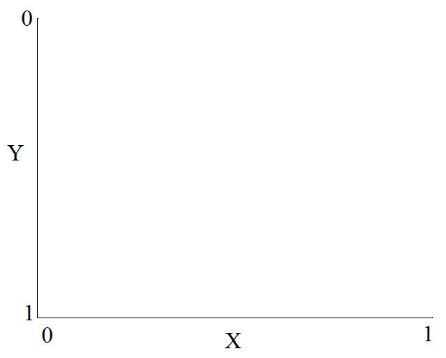

<style>

body {
text-align: justify}

blockquote {
  background: #f9f9f9;
  border-left: 5px solid #ccc;
  margin: 1.5em 10px;
  padding: 0.5em 1.5em;
}
</style>


```{r echo = FALSE, eval=TRUE, message=FALSE, warning=FALSE}
require(knitr)
require(kableExtra)
require(here)
require(htmltools)
require(mime)
require(ggplot2)
require(gridExtra)

# the default output hook
hook_output = knit_hooks$get('output')
knit_hooks$set(output = function(x, options) {
    if (!is.null(n <- options$out.lines)) {
        x = knitr:::split_lines(x)
        if (length(x) > n) {
            # truncate the output
            x = c(head(x, n), '....\n')
        }
        x = paste(x, collapse = '\n')  # paste first n lines together
    }
    hook_output(x, options)
})

opts_chunk$set(out.lines = 40)
opts_chunk$set(width = 40)
options(max.print=1000000)
options(knitr.table.format = 'html') 
options(knitr.kable.NA = '')
options(scipen=99)
options(digits = 4)
options(width = 80)
```

Join me to get your feet wet with thousands of models available on Hugging Face! Hugging Face is like a CRAN of pre-trained AI/ML models. There are thousands of pre-trained models that can be imported and used within seconds at no charge to achieve tasks like text generation, text classification, translation, speech recognition, image classification, object detection, etc. In this post, I am exploring how to access these pre-trained models without leaving the comfort of RStudio using the `reticulate` package.
  
# The `reticulate` package

The `reticulate` package provides an interface to call and run Python from R. There is an [excellent website](https://rstudio.github.io/reticulate/) with many details about this package, so I will not repeat the same information. I would recommend spending some time on this website and installing the reticulate package following the instructions on the website. In addition, I also had [Anaconda](https://www.anaconda.com/products/individual) software previously installed on my computer, and it already has Python.

First, install the reticulate package and Anaconda. Then, load the reticulate package and check the default python configurations. 

```{r, echo=TRUE,eval=TRUE}

library(reticulate)

py_config()
```

Currently, it is set to use Python 3.8, which came with Anaconda. If you see nothing when you run `py_config()`, you need to install Python. If you don't have Anaconda or Python installed on your computer, you may check the `?install_miniconda` function. You can install Python directly by using this function, and it creates a default virtual Python environment (r-reticulate) you can use to import Python modules moving forward. If you have never done this, a set of useful functions to check are listed below.

```{r, echo=TRUE,eval=FALSE}
?install_miniconda
?conda_list
?conda_install
?use_condaenv
```

`conda_list` returns the available Python environments created before on your computer.

```{r, echo=TRUE,eval=TRUE}
 conda_list()
```

The output indicates that there are two Python environments on my computer. The first one was the base Python environment created when I installed Anaconda. The second one was the r-reticulate environment when I installed r-miniconda along with the `reticulate` package. I will be using the base environment that comes with Anaconda. So, I declare it below using the `use_condaenv` function.

```{r, echo=TRUE,eval=TRUE}
use_condaenv('Anaconda3')
```

All Python modules I will need moving forward will be installed in this environment. You can install Python modules using the `?conda_install` function, similar to the `install.packages()` command used while installing a new R library. Below is an example for installing the `transformers` module, and I will list all other modules needed for the rest of this post. These modules should all be installed, so the rest of the code in this post work.

```{r, echo=TRUE,eval=FALSE}

# Install the python module to your specified Python environment

conda_install(envname = 'Anaconda3',
              packages = 'transformers',
              pip=TRUE)

# List of Python modules needed in this post

  # transformers
  # torch
  # torchvision
  # numpy
  # PIL
  # librosa
  # requests
  # timm
  # detoxify

```

I will also use the magick, kable, and kableExtra packages in R at the end while dealing with the object detection task.

```{r, echo=TRUE,eval=FALSE}

# Install packages

install.packages('magick')
install.packages('kable')
install.packages('kableExtra')

```

# Hugging Face Models

If you go to the [Models tab of Hugging Face](https://huggingface.co/models), there are more than 27,000 models available to use. I find it similar to the CRAN repository for the R packages, except it is for pre-trained AI/ML models. Some of these models probably cost tens of thousands of dollars, if not more.

These models are currently grouped in three major areas (Natural Language Processing, Audio, and Computer Vision), and each area has multiple tags for a different type of task.

- Natural Language Processing
  - Fill-Mask
  - Question Answering
  - Summarization
  - Table Question Answering
  - Text Classification
  - Text Generation
  - Text2Text Generation
  - Token Classification
  - Translation
  - Zero-Shot Classification
  - Sentence Similarity
  - Conversational
  - Feature Extraction

- Audio
  -Text-to-Speech
  - Automatic Speech Recognition
  - Audio-to-Audio
  - Audio Classification
  - Voice Activity Detection

- Computer Vision
  - Image Classification
  - Object Detection
  - Image Segmentation
  - Text-to-Image
  - Image-to-Text

You can filter a specific subset of models developed for that specific tag when you click a tag. In this post, I checked the most downloaded model for each tag and tried to reproduce an example for using this model to accomplish the task. Some of them were straightforward, but some required extra effort to search the web due to the lack of documentation. I couldn't find much information for specific tasks and models, so I abandoned some of these tasks. At the end of each demo, I provide the links for the pages I learned as I try to reproduce the examples.

I am not an expert in any of these models and am a very beginner Python user. I will try to explain things as much as possible, and please take my explanations with a grain of salt. As I started this post, my original intention was only to reproduce some examples.

## Natural Language Processing

### Fill-Mask

The **Fill-Mask** task is used to provide partial information in a text and ask the NLP model to complete the sentence for you. For instance, you can write a sentence like the following:


<blockquote>
Istanbul is the _____ of Turkey.
</blockquote>

There are many pre-trained NLP models for any NLP task, and I will use `roberta-base` for this task. First, we import the python libraries and then define `tokenizer` and `model` as two objects in the R environment. These objects will be downloaded to your computer when you first use them. Note that some of these models are very big, so make sure you have enough space on your computer.

```{r, echo=TRUE,eval=TRUE}

transformers <- import('transformers')
torch        <- import('torch')

tokenizer <- transformers$AutoTokenizer$from_pretrained('roberta-base')

model     <- transformers$AutoModelForMaskedLM$from_pretrained('roberta-base')
```

Each NLP model may have a different format for the masked word. So, it is a good idea to check the mask token.

```{r, echo=TRUE,eval=TRUE}
tokenizer$mask_token
tokenizer$mask_token_id
```

Now, we can prepare the input text accordingly and tokenize it.

```{r, echo=TRUE,eval=TRUE}

txt <- 'Istanbul is the <mask> of Turkey.'

input <- tokenizer$encode(text = txt,return_tensors="pt")
input
input$shape
```

This process encodes the words in our sentence (and some other hidden tokens) to their numeric representations. For instance, the numeric code for the mask token is 50264, or the numeric code for "_the" is 5. The returned object is a tensor with a length 10.

```{r, echo=TRUE,eval=TRUE}
tokenizer$encode('<mask>')
tokenizer$encode(' the')
```

I will locate the position of the mask token in the input tensor, because I will need it later.

```{r, echo=TRUE,eval=TRUE}
loc <- which(input$tolist()[[1]] == tokenizer$mask_token_id)
loc
  # <mask> is the 6th token in my input tensor
```

I will submit the input tensor to the model. 

```{r, echo=TRUE,eval=TRUE}
token_logits <- model(input)$logits$detach()
token_logits
token_logits$shape
```

The output returns logits for all 50265 words in the `roberta-base` dictionary for each token position (there are ten tokens in my sentence). These logits represent the probability of each word in the dictionary for that specific token position. In this case, my only interest is the **<mask>** token in the 6th position. Now, I find the three words with the highest calculated probability for the 6th token position in the code below.

```{r, echo=TRUE,eval=TRUE}

# Note that python indices start from 0
# So, we ask for loc-1 below

  masked_token_logits <- token_logits[0][loc-1]
  masked_token_logits
  masked_token_logits$shape
  
# Find the top three words based on probability calculated from the model
  
top_3 <- torch$topk(masked_token_logits, k = 3L)
top_3

# Decode these indices to find the corresponding words 
# from the roberta-base dictionary

unmask <- tokenizer$decode(token_ids = top_3['indices'])
unmask

```

The model says the three words that would most likely be appropriate for the missing word is **capital**, **Capital**, and **center**. Below is some formatting to get the sentence with each of these three words.

```{r, echo=TRUE,eval=TRUE}

unmask_ <- strsplit(unmask,' ')[[1]][-1]

gsub(pattern = '<mask>', replacement = unmask_[1], x = txt)
gsub(pattern = '<mask>', replacement = unmask_[2], x = txt)
gsub(pattern = '<mask>', replacement = unmask_[3], x = txt)
```


```{r, echo=FALSE,eval=TRUE,warning=TRUE,message=TRUE}
a <- ls()
a <- a[!a%in%c('hook_output')]

rm(list = a)
```


We can use a different NLP model, and the code would be almost identical. The only difference would be the mask token.
For instance, if we use the `bert-base-uncased` model, the mask token is defined as [MASK]. The code below runs the same task with the `bert-base-uncased` model. As you will see, the three words this model predicted for the missing piece are **capital**, **heart**, **birthplace**.

```{r, echo=TRUE,eval=TRUE,warning=TRUE,message=TRUE}

transformers <- import('transformers')
torch        <- import('torch')

tokenizer <- transformers$AutoTokenizer$from_pretrained('bert-base-uncased')

model     <- transformers$AutoModelForMaskedLM$from_pretrained('bert-base-uncased')

tokenizer$mask_token
tokenizer$mask_token_id

txt <- 'Istanbul is the [MASK] of Turkey.'

input <- tokenizer$encode(text = txt,return_tensors="pt")
input

loc <- which(input$tolist()[[1]] == tokenizer$mask_token_id)

token_logits <- model(input)$logits

masked_token_logits <- token_logits[0][loc-1]

top_3 <- torch$topk(masked_token_logits, k = as.integer(3))

unmask <- tokenizer$decode(token_ids = top_3['indices'])

unmask_ <- strsplit(unmask,' ')[[1]]

gsub(pattern = '\\[MASK]', replacement = unmask_[1], x = txt)
gsub(pattern = '\\[MASK]', replacement = unmask_[2], x = txt)
gsub(pattern = '\\[MASK]', replacement = unmask_[3], x = txt)

```


```{r, echo=FALSE,eval=TRUE,warning=TRUE,message=TRUE}
a <- ls()
a <- a[!a%in%c('hook_output')]

rm(list = a)
```

Resources

- https://huggingface.co/roberta-base
- https://huggingface.co/bert-base-uncased
- https://www.kaggle.com/juliusalphonso/filling-in-masked-words-with-roberta

### Text Classification

A given text can be classified in many different ways. The most popular one is sentiment analysis predicting whether a text carries a negative, neutral, or positive sentiment. Or, we can try to predict the emotion (sadness, joy, love, anger, fear, surprise). We can also try to predict whether or not a given text is toxic. [The subset of models on Hugging Face for text classification](https://huggingface.co/models?pipeline_tag=text-classification) offers a variety of analyses. I will reproduce the examples from three models predicting slightly different things for a given text.

#### Sentiment Analysis

The first example is the most downloaded model in this category, [`cardiffnlp/twitter-roberta-base-sentiment`](https://huggingface.co/cardiffnlp/twitter-roberta-base-sentiment). Let's import the modules we will need, and load the `tokenizer` and `model` objects for this specific model.

```{r, echo=TRUE,eval=TRUE, message=FALSE,warning=FALSE}

transformers <- import('transformers')

tokenizer <- transformers$AutoTokenizer$from_pretrained('cardiffnlp/twitter-roberta-base-sentiment')

model     <- transformers$AutoModelForSequenceClassification$from_pretrained('cardiffnlp/twitter-roberta-base-sentiment')
```

The input text is plain text as a character string, and we tokenize it using the `tokenizer` object. Note that I tried to trick the model by putting some negative words in the text; however, the sentence's sentiment was positive.

```{r, echo=TRUE,eval=TRUE, message=FALSE,warning=FALSE}

txt <- "Dr. Z's class was not very boring and not disorganized. I would definitely take it again."


input <- tokenizer$encode(text = txt,return_tensors="pt")
input
input$shape

```

After tokenization, we submit the input tensor to the model object, producing logits.

```{r, echo=TRUE,eval=TRUE, message=FALSE,warning=FALSE}

output <- model(input)$logits
output
output$shape
```

The final output is a tensor that includes three numbers. These numbers are related with three categories: Negative (the first element), Neutral (the second element), and Positive (the third element). To transform the logits to probabilities, we apply a softmax transformation.

```{r, echo=TRUE,eval=TRUE, message=FALSE,warning=FALSE}

scores <- output$detach()$numpy()
scores

# Softmax transformation to get probabilities for Negative, Neutral, and Positive

 exp(scores)/sum(exp(scores))

  # the first probability is for Negative
  # the second category is Neutral
  # the third category is Positive
```


The model predicts that the probability of this text having a positive sentiment is 0.936, having a negative sentiment is 0.057, and having a neutral sentiment is 0.008. (Nice job!) 

Resources:

- https://huggingface.co/cardiffnlp/twitter-roberta-base-sentiment

```{r, echo=FALSE,eval=TRUE,warning=TRUE,message=TRUE}
a <- ls()
a <- a[!a%in%c('hook_output')]

rm(list = a)
```

#### Detecting Emotions

The second example is another model in the Text Classification category to specifically developed for detecting emotions such as sadness, joy, love, anger, fear, and surprise, [`bhadresh-savani/distilbert-base-uncased-emotion`](https://huggingface.co/bhadresh-savani/distilbert-base-uncased-emotion). 

```{r, echo=TRUE,eval=TRUE, message=FALSE,warning=FALSE}

transformers <- import('transformers')

tokenizer <- transformers$AutoTokenizer$from_pretrained('bhadresh-savani/distilbert-base-uncased-emotion')

model     <- transformers$AutoModelForSequenceClassification$from_pretrained('bhadresh-savani/distilbert-base-uncased-emotion')
```

I will use the same input text, tokenize it using the `tokenizer` object, and then submit the input tensor to the model to obtain the logits.

```{r, echo=TRUE,eval=TRUE, message=FALSE,warning=FALSE}

txt <- "Dr. Z's class was not very boring and not disorganized. I would definitely take it again."

input <- tokenizer$encode(text = txt,return_tensors="pt")

output <- model(input)$logits
output
output$shape

```

The output returns six numbers related to six categories. We can check the order of categories to match these numbers to these categories.

```{r, echo=TRUE,eval=TRUE, message=FALSE,warning=FALSE}
model$config$id2label
```


Let's apply the softmax transformation to obtain the probabilities for each category.

```{r, echo=TRUE,eval=TRUE, message=FALSE,warning=FALSE}

scores <- output$detach()$numpy()

prob <- exp(scores)/sum(exp(scores))

data.frame(class = unlist(model$config$id2label),
           prob  = as.numeric(prob))
```

The model predicted emotion for this text is **sadness** with a probability estimate of 0.996 (!!!)

Resources:

- https://huggingface.co/bhadresh-savani/distilbert-base-uncased-emotion

```{r, echo=FALSE,eval=TRUE,warning=TRUE,message=TRUE}
a <- ls()
a <- a[!a%in%c('hook_output')]

rm(list = a)
```


#### Toxicity

The final example in this category is the [**Detoxify**](https://huggingface.co/unitary/toxic-bert) module. This Python module has trained model to predict toxic comments based on the datasets from three Jigsaw challenges on Kaggle: [Toxic comment classification](https://www.kaggle.com/c/jigsaw-toxic-comment-classification-challenge), [Unintended Bias in Toxic comments](https://www.kaggle.com/c/jigsaw-unintended-bias-in-toxicity-classification), [Multilingual toxic comment classification](https://www.kaggle.com/c/jigsaw-multilingual-toxic-comment-classification).

For a given sentence, the model returns a probability estimate for six different areas: toxic, severe toxic, obscene, threat, insult, and identity_hate. Let's take the following text, and get predictions from this model.

<blockquote>
Immigrants are stealing our jobs. Send them back to where they come from! THEY DON'T DESERVE TO LIVE IN AMERICA!
</blockquote>

```{r, echo=TRUE,eval=TRUE,warning=FALSE,message=FALSE}

# Load the Python module

detoxify <- import('detoxify')

# Input text

txt <- "Immigrants are stealing our jobs. Send them back to where they come from! THEY DON'T DESERVE TO LIVE IN AMERICA!"

# Predict

pred <- detoxify$Detoxify('original')$predict(txt)
unlist(pred)
```

Note that the text input can be a vector of texts. For instance, we can take 5 text strings as a vector and return the probability estimates in these six areas as a 5 x 6 matrix.

```{r, echo=TRUE,eval=TRUE}

txt <- c("No, he is an arrogant, self serving, immature idiot. Get it right.",
         "Simple. You are stupid!",
         "The overall organization and text are good.",
         "Who is the man in the high castle?",
         "This is worse than I thought. This user has a sockpuppet account!!")
         
pred <- detoxify$Detoxify('original')$predict(txt)

unlist(pred)


# Some reorganization of the output

probs <- matrix(unlist(pred),
                nrow = 5,
                ncol=6,
                byrow=FALSE)

data.frame(txt             = txt,
           toxicity        = round(probs[,1],2),
           severe_toxicity = round(probs[,2],2),
           obscene         = round(probs[,3],2),
           threat          = round(probs[,4],2),
           insult          = round(probs[,5],2),
           identity_attach = round(probs[,6],2))

``` 

Note that the probabilities within a row do not necessarily add up to one. If I am not mistaken, I think the model has sub models that make an independent binary prediction for each category.

```{r, echo=FALSE,eval=TRUE,warning=TRUE,message=TRUE}
a <- ls()
a <- a[!a%in%c('hook_output')]

rm(list = a)
```

### Extractive Question Answering

Extractive Question Answering is the task of extracting an answer from a text given a question. We provide two inputs as text strings. The first input is a question. The second input is context. The model extracts the answer for the question from a given text.

For instance, let's say we have the following text as a context.

<blockquote>
In probability theory, a normal (or Gaussian or Gauss or Laplace–Gauss) distribution is a type of continuous probability distribution for a real-valued random variable. The parameter mu is the mean or expectation of the distribution (and also its median and mode), while the parameter sigma is its standard deviation. A random variable with a Gaussian distribution is said to be normally distributed, and is called a normal deviate. Normal distributions are important in statistics and are often used in the natural and social sciences to represent real-valued random variables whose distributions are not known. Their importance is partly due to the central limit theorem. It states that, under some conditions, the average of many samples (observations) of a random variable with finite mean and variance is itself a random variable—whose distribution converges to a normal distribution as the number of samples increases. Therefore, physical quantities that are expected to be the sum of many independent processes, such as measurement errors, often have distributions that are nearly normal.
</blockquote>

Then, we ask the following question.

<blockquote>
What is the parameter mu in a normal distribution?
</blockquote>

The model should find the relevant part in the text and extract the text that responds to this question. See below the code for this example using the most popular model in this category, [deepset/roberta-base-squad2](https://huggingface.co/deepset/roberta-base-squad2)

```{r, echo=TRUE,eval=TRUE,message=FALSE,warning=FALSE}

# Load the python libraries

  transformers <- import('transformers')
  torchvision  <- import('torchvision')
  torch        <- import('torch')

# Load the tokenizer and model for roberta-base-squad2

  tokenizer <- transformers$AutoTokenizer$from_pretrained('deepset/roberta-base-squad2')
  
  model     <- transformers$AutoModelForQuestionAnswering$from_pretrained('deepset/roberta-base-squad2')

# Text inputs for the question and context
  
  question <- "What is the parameter mu in a normal distribution?"
  
  # Copy/paste the same text from context as written above
  # For some reason RMarkdown doesn't display it in the code below when I knit
  # the document
  
  context  <- "In probability theory, a normal (or Gaussian or Gauss or Laplace–Gauss) distribution is a type of continuous probability distribution for a real-valued random variable. The parameter mu is the mean or expectation of the distribution (and also its median and mode), while the parameter sigma is its standard deviation. A random variable with a Gaussian distribution is said to be normally distributed, and is called a normal deviate. Normal distributions are important in statistics and are often used in the natural and social sciences to represent real-valued random variables whose distributions are not known. Their importance is partly due to the central limit theorem. It states that, under some conditions, the average of many samples (observations) of a random variable with finite mean and variance is itself a random variable—whose distribution converges to a normal distribution as the number of samples increases. Therefore, physical quantities that are expected to be the sum of many independent processes, such as measurement errors, often have distributions that are nearly normal."

# Tokenize the inputs
    
  input <- tokenizer$encode(text      = question,
                            text_pair = context,
                            return_tensors="pt")
  
  input$shape
  
  # there are 219 tokens in the context

# Submit the input tensor to the model
  
  output <- model(input)

  # the model returns two elements
  
  # the first element includes the logits for the starting position of the answer
    # output$start_logits
  
  # the second element includes the logits for the ending position of the answer
  
# Extract the most likely token position to start the respond
  
  start <- output$start_logits$argmax(-1L)$item()
  start

# Extract the most likely token position to end the respond
  
  end <- output$end_logits$argmax(-1L)$item()
  end

# Decode the words between starting position and ending position
# This is the response the model predicts for the given question
  
  tokenizer$decode(input[0][start:end])

```

```{r, echo=FALSE,eval=TRUE,warning=TRUE,message=TRUE}
a <- ls()
a <- a[!a%in%c('hook_output')]

rm(list = a)
```


Resources:

- https://huggingface.co/deepset/roberta-base-squad2

### Summarization

In Summarization, the model takes a longer text and generates a shorter text as a summary.

For instance, let's say we have the following text.

<blockquote>
New York (CNN)When Liana Barrientos was 23 years old, she got married in Westchester County, New York. A year later, she got married again in Westchester County, but to a different man and without divorcing her first husband. Only 18 days after that marriage, she got hitched yet again. Then, Barrientos declared 'I do' five more times, sometimes only within two weeks of each other. In 2010, she married once more, this time in the Bronx. In an application for a marriage license, she stated it was her 'first and only' marriage. Barrientos, now 39, is facing two criminal counts of 'offering a false instrument for filing in the first degree,' referring to her false statements on the 2010 marriage license application, according to court documents. Prosecutors said the marriages were part of an immigration scam. On Friday, she pleaded not guilty at State Supreme Court in the Bronx, according to her attorney, Christopher Wright, who declined to comment further. After leaving court, Barrientos was arrested and charged with theft of service and criminal trespass for allegedly sneaking into the New York subway through an emergency exit, said Detective Annette Markowski, a police spokeswoman. In total, Barrientos has been married 10 times, with nine of her marriages occurring between 1999 and 2002. All occurred either in Westchester County, Long Island, New Jersey or the Bronx. She is believed to still be married to four men, and at one time, she was married to eight men at once, prosecutors say. Prosecutors said the immigration scam involved some of her husbands, who filed for permanent residence status shortly after the marriages. Any divorces happened only after such filings were approved. It was unclear whether any of the men will be prosecuted. The case was referred to the Bronx District Attorney's Office by Immigration and Customs Enforcement and the Department of Homeland Security's Investigation Division. Seven of the men are from so-called 'red-flagged' countries, including Egypt, Turkey, Georgia, Pakistan and Mali. Her eighth husband, Rashid Rajput, was deported in 2006 to his native Pakistan after an investigation by the Joint Terrorism Task Force. If convicted, Barrientos faces up to four years in prison.  Her next court appearance is scheduled for May 18.
</blockquote>

The code below generates a model predicted summary for this text using the most downloaded model in this category, [facebook/bart-large-cnn](https://huggingface.co/facebook/bart-large-cnn).

```{r, echo=TRUE,eval=TRUE}

transformers <- import('transformers')

tokenizer <- transformers$AutoTokenizer$from_pretrained('facebook/bart-large-cnn')

model     <- transformers$AutoModelForSeq2SeqLM$from_pretrained('facebook/bart-large-cnn')


# Copy/paste the same text above using double quotes
# For some reason RMarkdown doesn't display it in the code below when I knit
# the document
  
txt <- "New York (CNN)When Liana Barrientos was 23 years old, she got married in Westchester County, New York. A year later, she got married again in Westchester County, but to a different man and without divorcing her first husband. Only 18 days after that marriage, she got hitched yet again. Then, Barrientos declared 'I do' five more times, sometimes only within two weeks of each other. In 2010, she married once more, this time in the Bronx. In an application for a marriage license, she stated it was her 'first and only' marriage. Barrientos, now 39, is facing two criminal counts of 'offering a false instrument for filing in the first degree,' referring to her false statements on the 2010 marriage license application, according to court documents. Prosecutors said the marriages were part of an immigration scam. On Friday, she pleaded not guilty at State Supreme Court in the Bronx, according to her attorney, Christopher Wright, who declined to comment further. After leaving court, Barrientos was arrested and charged with theft of service and criminal trespass for allegedly sneaking into the New York subway through an emergency exit, said Detective Annette Markowski, a police spokeswoman. In total, Barrientos has been married 10 times, with nine of her marriages occurring between 1999 and 2002. All occurred either in Westchester County, Long Island, New Jersey or the Bronx. She is believed to still be married to four men, and at one time, she was married to eight men at once, prosecutors say. Prosecutors said the immigration scam involved some of her husbands, who filed for permanent residence status shortly after the marriages. Any divorces happened only after such filings were approved. It was unclear whether any of the men will be prosecuted. The case was referred to the Bronx District Attorney's Office by Immigration and Customs Enforcement and the Department of Homeland Security's Investigation Division. Seven of the men are from so-called 'red-flagged' countries, including Egypt, Turkey, Georgia, Pakistan and Mali. Her eighth husband, Rashid Rajput, was deported in 2006 to his native Pakistan after an investigation by the Joint Terrorism Task Force. If convicted, Barrientos faces up to four years in prison.  Her next court appearance is scheduled for May 18."

# Tokenize the input text

input <- tokenizer$encode(text = txt,
                          return_tensors="pt")

# Generate the predicted tokens for the summary text

output <- model$generate(input)

# Decode the output tokens

tokenizer$batch_decode(output)

# Too long to print, so I wrap it in kable

summary_txt <- as.matrix(tokenizer$batch_decode(output))

require(kableExtra)

summary_txt %>%
  kbl() %>%
  kable_styling()

```

```{r, echo=FALSE,eval=TRUE,warning=TRUE,message=TRUE}
a <- ls()
a <- a[!a%in%c('hook_output')]

rm(list = a)
```


Resources:

- https://huggingface.co/facebook/bart-large-cnn

### Text Generation

The purpose of the text generation task is to create meaningful continuation of a text. For instance, suppose I start with the following sentence.

<blockquote>
My name is Cengiz and I am from Turkey.
</blockquote>

How would an NLP model continue this sentence? Below is the code to generate a continuation for this sentence using the [GPT2 model](https://huggingface.co/gpt2).

```{r, echo=TRUE,eval=TRUE,warning=FALSE,message=FALSE}

# Load the module

transformers <- import('transformers')

# Load the tokenizer and model

tokenizer <- transformers$AutoTokenizer$from_pretrained('gpt2')

model     <- transformers$GPT2LMHeadModel$from_pretrained('gpt2')

# Input text

txt <- 'My name is Cengiz and I am from Turkey.'

# Tokenize the input

input <- tokenizer$encode(txt,return_tensors='pt')
input

# Generate the continuation text
# you can play with arguments like
# max_length, num_beams, no_repeat_ngram_size,num_return_sequences, etc.
# I don't know what some of these mean and how they impact the generated text

  # 100L, is just 100 as integer
  # If you use only 100, it is numeric (double) and the function gives error 
  # because it expects integers
  
output <- model$generate(input, 
                         max_length           = 100L,
                         num_beams            = 20L,
                         no_repeat_ngram_size = 2L,
                         num_return_sequences = 1L,
                         early_stopping       =TRUE)


# Too long to print, so I wrap it in kable

new_txt <- as.matrix(tokenizer$batch_decode(output))

new_txt %>%
  kbl() %>%
  kable_styling()
```

```{r, echo=FALSE,eval=TRUE,warning=TRUE,message=TRUE}
a <- ls()
a <- a[!a%in%c('hook_output')]

rm(list = a)
```


**Note**: I didn't write this. This is what GPT2 wrote, and it is hilarious!

Resources:

- https://huggingface.co/gpt2
- https://www.kaggle.com/tuckerarrants/text-generation-with-huggingface-gpt2


### Text2Text Generation

Like Text Classification, there are different tasks that can be considered under the Text2Text Generation category. I will reproduce examples for Generating a Headline, Generating a Question with and without Supervision, and Paraphrasing.

#### Generate a Headline

The purpose of this task is to generate a headline for a given text. For instance, let's consider the following text.

<blockquote>
Very early yesterday morning, the United States President Donald Trump reported he and his wife First Lady Melania Trump tested positive for COVID-19. Officials said the Trumps' 14-year-old son Barron tested negative as did First Family and Senior Advisors Jared Kushner and Ivanka Trump. Trump took to social media, posting at 12:54 am local time (0454 UTC) on Twitter, 'Tonight, [Melania] and I tested positive for COVID-19. We will begin our quarantine and recovery process immediately. We will get through this TOGETHER!' Yesterday afternoon Marine One landed on the White House's South Lawn flying Trump to Walter Reed National Military Medical Center (WRNMMC) in Bethesda, Maryland. Reports said both were showing 'mild symptoms'. Senior administration officials were tested as people were informed of the positive test. Senior advisor Hope Hicks had tested positive on Thursday.
Presidential physician Sean Conley issued a statement saying Trump has been given zinc, vitamin D, Pepcid and a daily Aspirin. Conley also gave a single dose of the experimental polyclonal antibodies drug from Regeneron Pharmaceuticals. According to official statements, Trump, now operating from the WRNMMC, is to continue performing his duties as president during a 14-day quarantine. In the event of Trump becoming incapacitated, Vice President Mike Pence could take over the duties of president via the 25th Amendment of the US Constitution. The Pence family all tested negative as of yesterday and there were no changes regarding Pence's campaign events.
</blockquote>

Below is the code generating a headline for this text using [the T5 language model](https://huggingface.co/Michau/t5-base-en-generate-headline) fine tuned for this task. 

Note that the input text string should start with `headline:`. For instance, the input string for the text above should be formatted as

```{r, echo=FALSE,eval=TRUE}

txt <- 'headline: Very early yesterday morning, the United States President Donald Trump reported he and his wife First Lady ...'


new_txt <- as.matrix(txt)

new_txt %>%
  kbl() %>%
  kable_styling()
```


```{r, echo=TRUE,eval=TRUE,warning=FALSE,message=FALSE}

# Load the modules
  
  transformers <- import('transformers')
  torch        <- import('torch')

# Load the tokenizer and model

  tokenizer <- transformers$AutoTokenizer$from_pretrained('Michau/t5-base-en-generate-headline')
  model     <- transformers$AutoModelForSeq2SeqLM$from_pretrained('Michau/t5-base-en-generate-headline')

# Input text string

  # Copy/paste the article above
  # Do not forget to put headline: at the beginning

  article <- "headline: Very early yesterday morning, the United States President Donald Trump reported he and his wife First Lady Melania Trump tested positive for COVID-19. Officials said the Trumps' 14-year-old son Barron tested negative as did First Family and Senior Advisors Jared Kushner and Ivanka Trump. Trump took to social media, posting at 12:54 am local time (0454 UTC) on Twitter, 'Tonight, [Melania] and I tested positive for COVID-19. We will begin our quarantine and recovery process immediately. We will get through this TOGETHER!' Yesterday afternoon Marine One landed on the White House's South Lawn flying Trump to Walter Reed National Military Medical Center (WRNMMC) in Bethesda, Maryland. Reports said both were showing 'mild symptoms'. Senior administration officials were tested as people were informed of the positive test. Senior advisor Hope Hicks had tested positive on Thursday.
  Presidential physician Sean Conley issued a statement saying Trump has been given zinc, vitamin D, Pepcid and a daily Aspirin. Conley also gave a single dose of the experimental polyclonal antibodies drug from Regeneron Pharmaceuticals. According to official statements, Trump, now operating from the WRNMMC, is to continue performing his duties as president during a 14-day quarantine. In the event of Trump becoming incapacitated, Vice President Mike Pence could take over the duties of president via the 25th Amendment of the US Constitution. The Pence family all tested negative as of yesterday and there were no changes regarding Pence's campaign events."

# Tokenize the input string
    
  input <- tokenizer$encode_plus(text = article, 
                                 return_tensors = 'pt')

  input_ids <- input['input_ids']

# Model predicted tokens for the headline
  
  output <- model$generate(input_ids = input_ids)
  output
  
# Decode the model predicted tokens

  tokenizer$batch_decode(output)
```

```{r, echo=FALSE,eval=TRUE,warning=TRUE,message=TRUE}
a <- ls()
a <- a[!a%in%c('hook_output')]

rm(list = a)
```

Resources:

- https://huggingface.co/Michau/t5-base-en-generate-headline

#### Generate a Question with Answer Supervision

There are model that can generate a question given a text string for an answer and another text string for context. Below is an example using the [T5 language model fine tuned for this task](https://huggingface.co/mrm8488/t5-base-finetuned-question-generation-ap).

```{r, echo=TRUE,eval=TRUE, message=FALSE,warning=FALSE}

# Load the module
  
  transformers <- import('transformers')

# Load the tokenizer and model
  
  tokenizer <- transformers$AutoTokenizer$from_pretrained('mrm8488/t5-base-finetuned-question-generation-ap')
    
  model     <- transformers$AutoModelWithLMHead$from_pretrained('mrm8488/t5-base-finetuned-question-generation-ap')

# Input string should be formatted as below
# 'answer: ..... context: .....'

  txt <- 'answer: 12 context: Apples'

# Tokenize the input and generate the question
  
  input <- tokenizer$encode(text = txt,return_tensors = 'pt')
  output <- model$generate(input)
  tokenizer$batch_decode(output)

# Another question with a different answer
  
  txt <- 'answer: red context: Apples'
  
  input <- tokenizer$encode(text = txt,return_tensors = 'pt')
  
  output <- model$generate(input)
  
  tokenizer$batch_decode(output)

# Another one
    
  txt <- 'answer: decay context: Apples'
  
  input <- tokenizer$encode(text = txt,return_tensors = 'pt')
  
  output <- model$generate(input)
  
  tokenizer$batch_decode(output)

```


```{r, echo=FALSE,eval=TRUE,warning=TRUE,message=TRUE}
a <- ls()
a <- a[!a%in%c('hook_output')]

rm(list = a)
```

Resources

- https://huggingface.co/mrm8488/t5-base-finetuned-question-generation-ap

#### Generate a Question with No Supervision

This is similar to the previous task, but there is no supervision. In other words, we don't provide an answer, and only provide a context. The model generates questions from this context. 

```{r, echo=TRUE,eval=TRUE, message=FALSE,warning=FALSE}


transformers <- import('transformers')

tokenizer <- transformers$AutoTokenizer$from_pretrained('valhalla/t5-base-e2e-qg')
  
model     <- transformers$AutoModelForSeq2SeqLM$from_pretrained('valhalla/t5-base-e2e-qg')

model     <- transformers$AutoModelWithLMHead$from_pretrained('valhalla/t5-base-e2e-qg')


txt = "I had twelwe apples. I ate two apples. Then, I gave five apples to my daughter. I didn't give any apple to my son."

input <- tokenizer$encode(text = txt,
                          return_tensors = 'pt')

output <- model$generate(input,
                         max_length = 50L)

qs <- tokenizer$batch_decode(output)

qs %>%
  as.matrix() %>%
  kbl() %>%
  kable_styling()

```

Resources:

- https://huggingface.co/valhalla/t5-base-e2e-qg

```{r, echo=FALSE,eval=TRUE,warning=TRUE,message=TRUE}
a <- ls()
a <- a[!a%in%c('hook_output')]

rm(list = a)
```

#### Paraphrasing

For a given sentence, these models paraphrases the sentence.

```{r, echo=TRUE,eval=TRUE, message=FALSE,warning=FALSE}

transformers <- import('transformers')
torch        <- import('torch')

tokenizer <- transformers$AutoTokenizer$from_pretrained('tuner007/pegasus_paraphrase')
model     <- transformers$PegasusForConditionalGeneration$from_pretrained('tuner007/pegasus_paraphrase')

txt1 <- "Her life spanned years of incredible change for women as they gained more rights than ever before."
txt2 <- "Giraffes like Acacia leaves and hay, and they can consume 75 pounds of food a day."


# Paraphrase the first text

input <- tokenizer$encode(text = txt1, return_tensors = 'pt')

output <- model$generate(input)

tokenizer$batch_decode(output)

# Paraphrase the second text

input <- tokenizer$encode(text = txt2, return_tensors = 'pt')

output <- model$generate(input)

tokenizer$batch_decode(output)
```

Resources:
 
- https://huggingface.co/tuner007/pegasus_paraphrase

```{r, echo=FALSE,eval=TRUE,warning=TRUE,message=TRUE}
a <- ls()
a <- a[!a%in%c('hook_output')]

rm(list = a)
```

### Translation

There are models fine tuned for the task of translating a text from one language to another. Check the following page for a number of pairs of translation pairs.

[https://huggingface.co/Helsinki-NLP]([https://huggingface.co/Helsinki-NLP])

I provide two examples. The first one is translating from Turkish to English, and the second one is translating from English to Spanish.

#### Turkish to English

```{r, echo=TRUE,eval = TRUE}

transformers <- import('transformers')

tokenizer <- transformers$AutoTokenizer$from_pretrained('Helsinki-NLP/opus-mt-tr-en')
model     <- transformers$AutoModelForSeq2SeqLM$from_pretrained('Helsinki-NLP/opus-mt-tr-en')


txt <- "Merhaba, ben Cengiz. Istanbul'da dogdum."


input <- tokenizer$encode(txt,return_tensors='pt')

output <- model$generate(input)

tokenizer$batch_decode(output)

```

Resources:

- https://huggingface.co/Helsinki-NLP/opus-mt-tr-en

#### English to Spanish

```{r, echo=TRUE,eval=TRUE}

transformers <- import('transformers')

tokenizer <- transformers$AutoTokenizer$from_pretrained('Helsinki-NLP/opus-mt-en-es')
model     <- transformers$AutoModelForSeq2SeqLM$from_pretrained('Helsinki-NLP/opus-mt-en-es')


txt <- "Hi, my name is Cengiz and I live in Eugene."


input <- tokenizer$encode(txt,return_tensors='pt')


output <- model$generate(input)

tokenizer$batch_decode(output)

```

Resources:

- https://huggingface.co/Helsinki-NLP/opus-mt-en-es

```{r, echo=FALSE,eval=TRUE,warning=TRUE,message=TRUE}
a <- ls()
a <- a[!a%in%c('hook_output')]

rm(list = a)
```

### Zero-shot Classification

In Zero-shot classification, we provide a text string as an input and then provide a class label. This class label could be anything. Then, the model predicts a probability of the given text to belong to this class label.

For instance, let's consider the following sentence.

<blockquote>
I will see the world one day.
</blockquote>

We can say that this sentence is related to for instance **traveling** or **exploration** but for instance not related to **cooking**. We can use a model to predict each hypothesis.

```{r, echo=TRUE,eval=TRUE, message=FALSE,warning=FALSE}

# Load the modules, tokenizer, and model

  transformers <- import('transformers')
  
  tokenizer <- transformers$AutoTokenizer$from_pretrained('facebook/bart-large-mnli')
  
  model     <- transformers$AutoModelForSequenceClassification$from_pretrained('facebook/bart-large-mnli')

# Input text
  
txt               = "I will see the world one day."

# Is this text related to cooking?

  input <- tokenizer$encode(text           = txt,
                            text_pair      = 'cooking',
                            return_tensors = 'pt',
                            truncation     = TRUE)

  output <- model(input)

  scores <- output$logits$detach()$tolist()[[1]]

  prob <- exp(scores)/sum(exp(scores))

  prob

  # the first element is FALSE, not related, prob = 0.906
  # the second element is Neutral, prob = 0.087
  # the second element is TRUE, related, prob = 0.006
  

# Is this text related to travel?

  
  input <- tokenizer$encode(text           = txt,
                            text_pair      = 'travel',
                            return_tensors = 'pt',
                            truncation     = TRUE)
  
  
  output <- model(input)
  
  scores <- output$logits$detach()$tolist()[[1]]
  
  prob <- exp(scores)/sum(exp(scores))
  
  prob
  
  # the first element is FALSE, not related, prob = 0.001
  # the second element is Neutral, prob = 0.229
  # the second element is TRUE, related, prob = 0.770
  
```


Resources:

- https://huggingface.co/facebook/bart-large-mnli

```{r, echo=FALSE,eval=TRUE,warning=TRUE,message=TRUE}
a <- ls()
a <- a[!a%in%c('hook_output')]

rm(list = a)
```


### Sentence Similarity

The purpose of this task is to compare two text and produce a score of similarity.

For instance, consider the following three sentences:

1) Today is a sunny day.

2) That is a happy person.

3) Weather is really nice.

We can say that Sentence 1 and 3 are more similar to each other as they are related to weather.

Let's compute the similarity scores for these three sentences.

```{r, echo=TRUE,eval=TRUE,warning=FALSE,message=FALSE}

transformers <- import('transformers')
torch        <- import('torch')

txt1 <- 'Today is a sunny day'
txt2 <- 'That is a happy person'
txt3 <- 'Weather is really nice'

tokenizer <- transformers$AutoTokenizer$from_pretrained('sentence-transformers/multi-qa-MiniLM-L6-cos-v1')
model     <- transformers$AutoModel$from_pretrained('sentence-transformers/multi-qa-MiniLM-L6-cos-v1')


# Create a function to create sentence embeddings for a given text.
# This function takes a text and generates a numeric representation of this text in 
# 384 dimensions. The input is a plain txt and the output is the sentence embeddings
# as a vector of 384 numbers

  encode_ <- function(txt){
    
    input       <- tokenizer(txt,padding=TRUE,truncation=TRUE,return_tensors = 'pt')
    output      <- model(input['input_ids'],return_dict=TRUE)
    embeddings  <- output$last_hidden_state$detach()
    input_mask_expanded <- input['attention_mask']$unsqueeze(as.integer(-1))$expand(embeddings$size())$float()
  
    num  <- torch$sum(torch$multiply(embeddings,input_mask_expanded),as.integer(1))
    den  <- torch$clamp(input_mask_expanded$sum(as.integer(1)),min = 1e-9)
    
    emb <- torch$nn$functional$normalize(torch$divide(num,den),
                                p = as.integer(2),
                                dim = as.integer(1))
    
    emb
  }

# Embeddings for the texts

emb1 <- encode_(txt1)
emb1$shape

emb2 <- encode_(txt2)
emb2$shape

emb3 <- encode_(txt3)
emb3$shape

# Compute the similarity between Sentence 1 and Sentence 2

torch$mm(emb1,
         emb2$transpose(0L,1L))$tolist()[[1]]

# Compute the similarity between Sentence 1 and Sentence 3

torch$mm(emb1,
         emb3$transpose(0L,1L))$tolist()[[1]]

```

The model predicted similarity score is 0.259 between Sentence 1 and Sentence 2 while the model predicted similarity score is 0.550 between Sentence 1 and Sentence 3. So, the model predicts that Sentence 1 and Sentence 3 are more similar to each other.

Resources:

- https://huggingface.co/sentence-transformers/multi-qa-MiniLM-L6-cos-v1

```{r, echo=FALSE,eval=TRUE,warning=TRUE,message=TRUE}
a <- ls()
a <- a[!a%in%c('hook_output')]

rm(list = a)
```

## Audio

### Automatic Speech Recognition

Speech recognition task takes an audio file and transcribes the audio to text. To produce an example of this task, I will use [this audio file](https://www.opdsupport.com/downloads/miscellaneous/sample-audio-files/61-miscellaneous/70-sample-audio-files/52-welcome-wav). You will need to download this file to your local drive.

The following code generates the speech based on this audio file.

```{r, echo=TRUE,eval=TRUE,warning=FALSE,message=FALSE}

# Load the Python Modules

  torch        <- import('torch')
  librosa      <- import('librosa')
  requests     <- import('requests')
  transformers <- import('transformers')

# Load the Wav2Vec2 tokenizer and the model

  tokenizer <- transformers$Wav2Vec2Tokenizer$from_pretrained('facebook/wav2vec2-base-960h')
  
  model     <- transformers$Wav2Vec2ForCTC$from_pretrained('facebook/wav2vec2-base-960h')

# Load the audio file from local drive
    
  sound.file <- librosa$load(here('_posts/huggingface/Welcome.WAV'),
                             sr = 16000)

# Tokenize the input audio file
  
  input_values = tokenizer(sound.file[1], 
                           return_tensors = "pt")

# Model prediction
  
  logits = model(input_values['input_values'])$logits

  prediction = torch$argmax(logits, dim = -1L)

# Decoding the prediction
  
  transcription = tokenizer$batch_decode(prediction)[[1]]
  
  transcription %>%
    as.matrix() %>%
    kbl() %>%
    kable_styling()

```

Resources:

- https://huggingface.co/facebook/wav2vec2-base-960h

- https://www.kdnuggets.com/2021/03/speech-text-wav2vec.html

```{r, echo=FALSE,eval=TRUE,warning=TRUE,message=TRUE}
a <- ls()
a <- a[!a%in%c('hook_output')]

rm(list = a)
```


### Audio Classification

Similar to Text Classification, you can use models to classify audio. [Hubert-Large for Emotion Recognition](https://huggingface.co/superb/hubert-large-superb-er) classify the audio using four different emotions: happy, angry, sad, and neutral.

The code below use the same audio file and predicts emotion.

```{r, echo=TRUE,eval=TRUE,warning=FALSE,message=FALSE}

torch        <- import('torch')
librosa      <- import('librosa')
transformers <- import('transformers')

tokenizer    <- transformers$Wav2Vec2FeatureExtractor$from_pretrained('superb/hubert-large-superb-er')
model <- transformers$HubertForSequenceClassification$from_pretrained('superb/hubert-large-superb-er')


sound.file <- librosa$load(here('_posts/huggingface/Welcome.WAV'),
                             sr = 16000)


input_values = tokenizer(sound.file[1], 
                         sampling_rate = 16000,
                         padding = TRUE,
                         return_tensors = "pt")


logits = model(input_values['input_values'])$logits
logits <- logits$detach()$tolist()[[1]]
logits

probs <- exp(logits)/sum(exp(logits))

# Labels

data.frame(labels = unlist(model$config$id2label),
           probs  = probs)
```

Resources:

- https://huggingface.co/superb/hubert-large-superb-er


```{r, echo=FALSE,eval=TRUE,warning=TRUE,message=TRUE}
a <- ls()
a <- a[!a%in%c('hook_output')]

rm(list = a)
```

## Computer Vision

### Image Classification

The prupose of the Image Classification task is to predict a label for the objects in an image. For this task, I will use the [Google's Vision Transformers model](https://huggingface.co/google/vit-base-patch16-224), the most popular model in this category. This model considers 1000 different class labels, and you can find all these labels in the table below. Given an image file, the model predicts a probability for each of the following labels.

```{r, echo=FALSE,eval=TRUE}

transformers <- import('transformers')
model  =  transformers$ViTForImageClassification$from_pretrained('google/vit-base-patch16-224')

labels <- as.matrix(unlist(model$config$id2label))

require(DT)

datatable(labels)
```

For the demonstration, I will use [this image at this link](http://images.cocodataset.org/val2017/000000039769.jpg).

<center>

</center>


```{r, echo=TRUE,eval=TRUE,warning=FALSE,message=FALSE}

# Load the Python modules
  
  transformers <- import('transformers')
  pil          <- import('PIL')
  requests     <- import('requests')
  torch        <- import('torch')
  
# Read the image file from url
  
  url   <- 'http://images.cocodataset.org/val2017/000000039769.jpg'
  
  image <- pil$Image$open(requests$get(url, stream=T)$raw)

# Load the feature extractor and model
  
  feature_extractor = transformers$ViTFeatureExtractor$from_pretrained('google/vit-base-patch16-224')

  model  =  transformers$ViTForImageClassification$from_pretrained('google/vit-base-patch16-224')

# Extract the features from the given image
  
  inputs  <- feature_extractor(images=image,return_tensors='pt')
  inputs['pixel_values']$shape
  
# Model predictions

  outputs = model(inputs['pixel_values'])
  logits  = outputs$logits
  
  # Softmax transformation of the logits to probabilities
  
  logits_ <- as.numeric(logits$detach()$numpy())
  
  probs   <- exp(logits_)/sum(exp(logits_))
  
  labels  <- as.matrix(unlist(model$config$id2label))
  
# Find the top 5 predicted categories 
  
  locs <- order(probs,decreasing=T)[1:5]
  
  data.frame(class = labels[locs],
            prob  = probs[locs])
```

Resources:

- https://huggingface.co/google/vit-base-patch16-224

```{r, echo=FALSE,eval=TRUE,warning=TRUE,message=TRUE}
a <- ls()
a <- a[!a%in%c('hook_output')]

rm(list = a)
```


### Object Detection

The purpose of the Object Detection task is to identify different objects in an image and provide the location of these objects in the image. For this task, I will use the [Facebook's DEtection TRansformer (DETR) model](https://huggingface.co/facebook/detr-resnet-50), the most popular model in this category. 

This model considers 91 different class labels (first being N/A), and you can find all these labels in the table below. Given an image file, the model identify if any of these classes exist in the image, and also provides a location of these objects in the given image.

```{r, echo=FALSE,eval=TRUE}
transformers <- import('transformers')
model     <-  transformers$DetrForObjectDetection$from_pretrained('facebook/detr-resnet-50')
labels <- as.matrix(unlist(model$config$id2label))

require(DT)

datatable(labels)
```

For the demonstration, I will again  use [the same image](http://images.cocodataset.org/val2017/000000039769.jpg). We can tell that there are two cats, two remotes, one blanket, and one couch in this image. Let's see if we can recover this information using the DETR model.
 

```{r, echo=TRUE,eval=TRUE,warning = FALSE, message= FALSE}

# Load the Python modules

  transformers <- import('transformers')
  pil          <- import('PIL')
  requests     <- import('requests')
  torchvision  <- import('torchvision')
  timm         <- import('timm')

# Read the image
    
  url   <- 'http://images.cocodataset.org/val2017/000000039769.jpg'
  
  image <- pil$Image$open(requests$get(url, stream=T)$raw)

# Load the feature extractor and model
  
  feat_ext  <- transformers$DetrFeatureExtractor$from_pretrained('facebook/detr-resnet-50')
  model     <- transformers$DetrForObjectDetection$from_pretrained('facebook/detr-resnet-50')

# Extract the features

  inputs  <- feat_ext(images=image,
                      return_tensors='pt')

# Model predictions
  
  outputs = model(inputs['pixel_values'])
  logits  = outputs$logits$detach()
  bboxes  = outputs$pred_boxes$detach()
  
  logits$shape
  
  bboxes$shape
```

This returns two important objects. It was really the most frustrating because I couldn't find any good documentation about what to do with these objects. Luckily, I find this discussion post, and the code included in the original question helped.

[https://stackoverflow.com/questions/68350133/facebook-detr-resnet-50-in-huggingface-hub](https://stackoverflow.com/questions/68350133/facebook-detr-resnet-50-in-huggingface-hub)

I will try to explain as much as I understand. The first objects includes predicted logits for 92 classes in 100 different ways. We first transform these logits to probabilities using a softmax transformation, and then we can format it as a 100 x 92 matrix.

```{r, echo=TRUE,eval=TRUE}

logit_mat <- matrix(nrow = 100, ncol = 92)

for(i in 0:99){
  logit_mat[i+1,] = logits$softmax(-1L)[0][i]$tolist()
}
```

I don't know why 100, or what each row here represents. Also, Column 92 is discarded for some reason. So, it leaves the logits for 91 classes originally listed in the table above.

```{r, echo=TRUE,eval=TRUE}

logit_mat <- logit_mat[,-92]

```

Finally, we do a search row by row and try to find whether or not there is any row that has a probability higher than a threshold. If we find such a row, we flag that row, and also identify the corresponding label for the column with a probability that exceeds the threshold.

```{r, echo=TRUE,eval=TRUE}

threshold <- 0.7
labels    <- unlist(model$config$id2label)

class <- c()
prob  <- c()
id    <- c()

for(i in 1:100){
  
  loc <- which(logit_mat[i,]>threshold)
  
  if(length(loc) !=0){
    
    cl <- labels[as.numeric(names(labels) )==(loc-1)]
    
    class <- c(class,cl)
    prob  <- c(prob,logit_mat[i,loc])
    id    <- c(id,i)
  }
}


data.frame(id    = id,
           class = class,
           prob  = prob)

```

Superb! So, it seems the model correctly identified the cats, remotes, and couch. 

What else? The model also returned boundary locations for these objects. Let's check how they look like.

```{r, echo=TRUE,eval=TRUE}

coord <- bboxes[0][id-1]$numpy()
coord

```

What are these numbers? The four columns are normalized coordinates for (X center, Y center, Width, Height). Also, I noticed that this is how the model imagines the coordinate system. Notice the range for the Y-axis is reversed.


<center>

</center>

So, these coordinates should be re-scaled and rearranged given the actual dimension of the image. The code below draw a rectangular box around each identified object using these coordinates and labels them.

```{r, echo=TRUE,eval=TRUE,warnings=TRUE,message=TRUE, fig.height=8,fig.width=8}

# Read the image

  library(magick)
  
  pic <- image_read('http://images.cocodataset.org/val2017/000000039769.jpg')
  image_info(pic)

# Set the actual width and height of the image

  width  <- image_info(pic)$width
  height <- image_info(pic)$height

# Descale the coordinates according to actual dimensions
    
  coord[,1] <- coord[,1]*width
  coord[,2] <- coord[,2]*height
  coord[,3] <- coord[,3]*width
  coord[,4] <- coord[,4]*height

# Reverse the Y scale
  
  coord[,2] <- height - coord[,2]

# Finalized coordinates 
# (X center, Y center, Width, Height)

  coord
  
# Plot the picture in the plot object

  plot(pic)

# For each of the identified object, draw a rectangular box around and label
    
  for(i in 1:nrow(coord)){
    
    rect(xleft   = coord[i,1] - coord[i,3]/2,
         ybottom = coord[i,2] - coord[i,4]/2,
         xright  = coord[i,1] + coord[i,3]/2,
         ytop    = coord[i,2] + coord[i,4]/2,
         border = 'blue',
         lwd    = 4)
    
    text(coord[i,1],coord[i,2],class[i])
  }
```

Resources:

- https://stackoverflow.com/questions/68350133/facebook-detr-resnet-50-in-huggingface-hub

- https://huggingface.co/facebook/detr-resnet-50