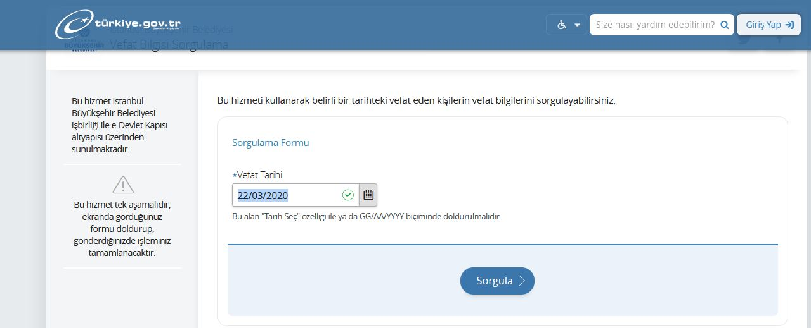
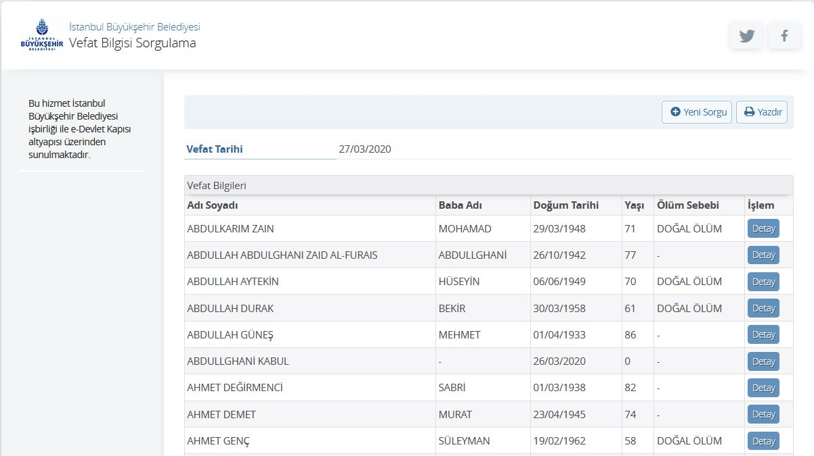

```{r setup, include=FALSE}
knitr::opts_chunk$set(echo = TRUE)
```

# Short Story

You can track the number of deceased individuals in Turkey using the shiny app at this link:

[https://cengiz-shiny.app/shiny/deceased_turkey/](https://cengiz-shiny.app/shiny/deceased_turkey/)

The app uses a dataset scraped and compiled from the numbers reported on [https://www.turkiye.gov.tr](https://www.turkiye.gov.tr/). The app reports the numbers from 11 major cities in which the data are available on [https://www.turkiye.gov.tr](https://www.turkiye.gov.tr/). These cities are:

- [Bursa](https://www.turkiye.gov.tr/bursa-buyuksehir-belediyesi-vefat-sorgulama)
- [Denizli](https://www.turkiye.gov.tr/denizli-buyuksehir-belediyesi-vefat-sorgulama)
- [Diyarbakir](https://www.turkiye.gov.tr/diyarbakir-buyuksehir-belediyesi-vefat-sorgulama)
- [Erzurum](https://www.turkiye.gov.tr/erzurum-buyuksehir-belediyesi-vefat-sorgulama)
- [Istanbul](https://www.turkiye.gov.tr/istanbul-buyuksehir-belediyesi-vefat-sorgulama)
- [Kahramanmaras](https://www.turkiye.gov.tr/kahramanmaras-buyuksehir-belediyesi-vefat-sorgulama)
- [Kocaeli](https://www.turkiye.gov.tr/kocaeli-buyuksehir-belediyesi-vefat-sorgulama)
- [Konya](https://www.turkiye.gov.tr/konya-buyuksehir-belediyesi-vefat-sorgulama)
- [Malatya](https://www.turkiye.gov.tr/malatya-buyuksehir-belediyesi-vefat-sorgulama)
- [Sakarya](https://www.turkiye.gov.tr/sakarya-buyuksehir-belediyesi-vefat-sorgulama)
- [Tekirdag](https://www.turkiye.gov.tr/tekirdag-buyuksehir-belediyesi-vefat-sorgulama)

By using this app, you can compare the number of deceased individuals for any given day or date range in 2020 to the number of deceased individuals in the past 10 years on the same day or same date range. You can look at the total number for all 11 cities, or you can examine city by city. The R code used to scrape the dataset can be downloaded from the link below:

[**DOWNLOAD THE R CODE USED TO SCRAPE THE DATASET**](files/scrap-compile.r)

The database is automatically updated on a daily basis by running another script and adding the new information for the past day. Also, due to the lag in reporting by the original source, the numbers for the prior 45 days are checked everyday and automatically updated on a daily basis. 

[**DOWNLOAD THE R CODE USED TO UPDATE THE DATASET ON A DAILY BASIS**](files/data_update.r)


# Long Story

The information about COVID-19 provided by authorities is very limited in Turkey. The only source of information is currently a tweet once a day by Dr. Fahretting Koca, the Minister of Health. At the time of this writing, the last tweet indicates that there were 3,672 tests made on Mar 23, and 293 individuals were positive, and there were seven individuals deceased because of Covid-19. 

<blockquote class="twitter-tweet"><p lang="tr" dir="ltr">SON 24 SAATTE 3.672 test sonuçlandı. 293 yeni tanı kondu. Çabalarımıza rağmen, hastalığa yenik düşen 7 insanımız daha oldu. GENÇLERE UYARIMIZ VAR: Salgının dışında değilsiniz. Hayatınızı yavaşlatın. Risk ortamına girmeyin. Riski evinize taşımayın. Evde kalın. Hayat eve sığar.</p>&mdash; Dr. Fahrettin Koca (@drfahrettinkoca) <a href="https://twitter.com/drfahrettinkoca/status/1242185496715018241?ref_src=twsrc%5Etfw">March 23, 2020</a></blockquote> <script async src="https://platform.twitter.com/widgets.js" charset="utf-8"></script> 


The Minister of Health announced the first positive case on Mar 11, and he is tweeting daily about the number of tests, positive cases, and number of deceased since Mar 16. Most people believe that Covid-19 was spreading much earlier and the government downplayed and delayed the announcement. Also, most people do not trust the numbers announced on a daily basis. I have seen on Twitter that a few people wondered whether or not it is possible to cross-check the numbers by using the official records of the number of deceased people. For instance, Dr. Abdullah Aydogan asked how we can find these statistics (in Turkish):

<blockquote class="twitter-tweet"><p lang="tr" dir="ltr">Son bir kaç yılda Istanbul (veya Turkiye) geneli ay ay (mumkunse hafta hafta) kaç kişinin öldüğüne dair bir veriyi nereden bulabiliriz? Mümkünse yaş aralıklarına göre. Fikri olan var mı?<a href="https://twitter.com/istatistikofisi?ref_src=twsrc%5Etfw">@istatistikofisi</a> mümkün mü?</p>&mdash; Abdullah Aydogan (@abdaydgn) <a href="https://twitter.com/abdaydgn/status/1241171292168097792?ref_src=twsrc%5Etfw">March 21, 2020</a></blockquote> <script async src="https://platform.twitter.com/widgets.js" charset="utf-8"></script> 

Also, Talha Oz, a PhD student at George Mason University, tweeted a brief report using data compiled from a government website (https://www.turkiye.gov.tr/):

<blockquote class="twitter-tweet"><p lang="en" dir="ltr">How can we know about the death toll from <a href="https://twitter.com/hashtag/coronavirus?src=hash&amp;ref_src=twsrc%5Etfw">#coronavirus</a> and fact-check the governments? Here is an idea, a dataset, and some interesting results from an early study on Turkey. <a href="https://t.co/xDck4OAO5B">https://t.co/xDck4OAO5B</a> <a href="https://t.co/TH0ApLEZXE">pic.twitter.com/TH0ApLEZXE</a></p>&mdash; Talha Oz (@tozCSS) <a href="https://twitter.com/tozCSS/status/1241975516787167232?ref_src=twsrc%5Etfw">March 23, 2020</a></blockquote> <script async src="https://platform.twitter.com/widgets.js" charset="utf-8"></script> 

The idea is to compare the number of deceased people in 2020 with the trends in the past 10 years for the same time interval. Unusual spikes in the number of deceased people, particularly people with an age of 65 or above, in 2020 in a specific city or for a specific time interval can give an idea about when the virus started spreading.

The official government website (https://www.turkiye.gov.tr/) includes the raw data of every deceased individual for 11 major cities.

- [Bursa](https://www.turkiye.gov.tr/bursa-buyuksehir-belediyesi-vefat-sorgulama)
- [Denizli](https://www.turkiye.gov.tr/denizli-buyuksehir-belediyesi-vefat-sorgulama)
- [Diyarbakir](https://www.turkiye.gov.tr/diyarbakir-buyuksehir-belediyesi-vefat-sorgulama)
- [Erzurum](https://www.turkiye.gov.tr/erzurum-buyuksehir-belediyesi-vefat-sorgulama)
- [Istanbul](https://www.turkiye.gov.tr/istanbul-buyuksehir-belediyesi-vefat-sorgulama)
- [Kahramanmaras](https://www.turkiye.gov.tr/kahramanmaras-buyuksehir-belediyesi-vefat-sorgulama)
- [Kocaeli](https://www.turkiye.gov.tr/kocaeli-buyuksehir-belediyesi-vefat-sorgulama)
- [Konya](https://www.turkiye.gov.tr/konya-buyuksehir-belediyesi-vefat-sorgulama)
- [Malatya](https://www.turkiye.gov.tr/malatya-buyuksehir-belediyesi-vefat-sorgulama)
- [Sakarya](https://www.turkiye.gov.tr/sakarya-buyuksehir-belediyesi-vefat-sorgulama)
- [Tekirdag](https://www.turkiye.gov.tr/tekirdag-buyuksehir-belediyesi-vefat-sorgulama)

For instance, this is how the webpage looks like for [Istanbul](https://www.turkiye.gov.tr/istanbul-buyuksehir-belediyesi-vefat-sorgulama). First, you enter the date in DD/MM/YYYY format and then submit the button.



It returns a table with six columns with the following information:

- First Name, Last Name
- Father Name
- Birth Date
- Age when deceased
- Diagnosed cause of death
- Detail (gives more information about funeral when clicked)



These tables were scraped for each day for each city beginning from Jan 01, 2010 so users can explore the trends for any specific day or date range during the past 10 years. The app is being updated on a daily basis by continuously scraping data from the original source.

[https://cengiz-shiny.app/shiny/deceased_turkey/](https://cengiz-shiny.app/shiny/deceased_turkey/).


