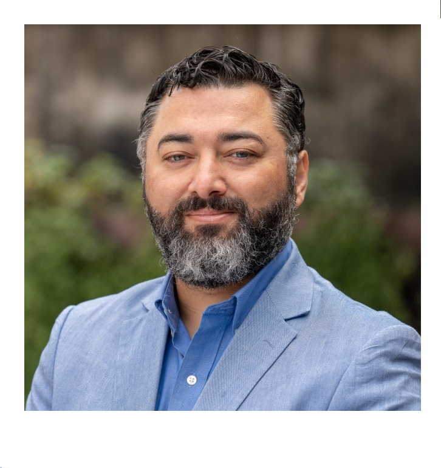

```{r setup, include=FALSE}
knitr::opts_chunk$set(echo = FALSE)
```


<div class="row">
  <div class="column" style="background-color:#ffffff;">

```{r, echo=FALSE, out.width= "45%", out.extra='style="float:right; padding:10px"'}



```

</div>
  <div class="column" style="background-color:#ffffff;text-align: justify;">

<p>I am an Associate Professor in the [Special Education program](https://education.uoregon.edu/sped) in the Department of Special Education and Clinical Sciences(SPECS) at the [University of Oregon](https://www.uoregon.edu/). Before joining the University of Oregon faculty in 2020, I served seven years in the Research, Measurement, and Evaluation Program in the [Department of Educational and Psychological Studies (EPS)](https://sites.education.miami.edu/eps/) at the [University of Miami](https://welcome.miami.edu/), specializing in educational measurement and statistics. 

I received my Ph.D. in [Quantitative Methods in Education program](https://www.cehd.umn.edu/edpsych/programs/qme/) from the Department of Educational Psychology at the University of Minnesota. During my graduate education, I held research positions with the Quantitative Methods in Education program and Office of Research and Consultation Services at the University of Minnesota. I also completed my internships at the Minneapolis Public Schools in Minnesota and ACT, Inc. in Iowa. While anything related to computation and statistics attracts my attention, my primary research interests in the past decade were in three areas: item response theory, statistical detection of test fraud, and nonlinear mixed-effects models.</p>

<p> I post blogs to develop and maintain a habit of writing and coding. I intend to blog about 

- reproducible R code for my published papers, 
- documentation about the R packages I have written,
- things I learn as I read papers in my research areas,
- some new ideas before I invest my time in writing a formal academic paper,
- tutorial type applications (in R) from courses I teach,
- any fancy implementation of R programming such as web scraping,
- and anything else that excites me about using R and my research.
</p>


```{r, child="data/favicons_cz.Rmd"}
```


```{r, child="data/favicons2_cz.Rmd"}
```
