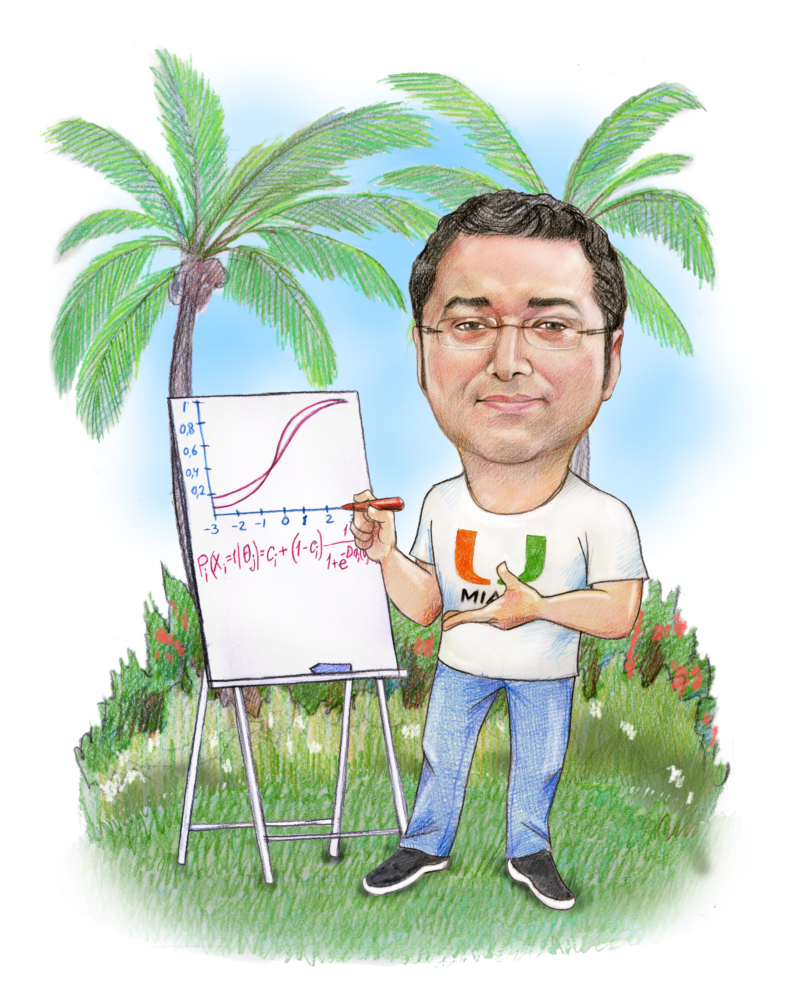

```{r setup, include=FALSE}
knitr::opts_chunk$set(echo = FALSE)
```


<div class="row">
  <div class="column" style="background-color:#ffffff;">

```{r, echo=FALSE, out.width= "45%", out.extra='style="float:right; padding:10px"'}



```

</div>
  <div class="column" style="background-color:#ffffff;text-align: justify;">

<p>I am an Associate Professor in the Research, Measurement, and Evaluation Program in the [Department of Educational and Psychological Studies (EPS)](https://sites.education.miami.edu/eps/) at the [University of Miami](https://welcome.miami.edu/), specializing in educational measurement and statistics. I joined the EPS faculty at the University of Miami in 2013. Before joining the EPS faculty, I received my Ph.D. in [Quantitative Methods in Education program](https://www.cehd.umn.edu/edpsych/programs/qme/) in the Department of Educational Psychology at the University of Minnesota. During my graduate education, I held research positions with the Quantitative Methods in Education program and Office of Research and Consultation Services at the University of Minnesota. I also completed my internships at the Minneapolis Public Schools in Minnesota and ACT, Inc. in Iowa. While anything related to computation and statistics attracts my attention, my primary research interests in the past decade were in three areas: item response theory, statistical detection of test fraud, and nonlinear mixed-effects models.</p>

<p> I post blogs to develop and maintain a habit of writing and coding. I intend to blog about 

- reproducible R code for my published papers, 
- documentation about the R packages I have written,
- things I learn as I read papers in my research areas,
- some new ideas before I invest my time in writing a formal academic paper,
- tutorial type applications (in R) from courses I teach,
- any fancy implementation of R programming such as web scraping,
- and anything else that excites me about using R and my research.
</p>


```{r, child="data/favicons_cz.Rmd"}
```


```{r, child="data/favicons2_cz.Rmd"}
```

**More information...**

<p> I am originally from Turkey. I was born and raised in [Istanbul](https://youtu.be/6nGoj2TVe2I) until I moved to another city, [Bolu](https://en.wikipedia.org/wiki/Bolu), to go to college before I came to the United States. My grandparents migrated to Istanbul in the late 1960s from [Sebinkarahisar](https://en.wikipedia.org/wiki/%C5%9Eebinkarahisar), a small town in [Giresun, Turkey](https://en.wikipedia.org/wiki/Giresun). I am married to a wonderful wife and have two amazing kids. 
</p>

<center>

```{r, echo=FALSE, out.width= "60%"}

knitr::include_graphics("images/family.jpg")

```
</center>

**Even more information...** 

<p>
I am a first-generation college student. My mom never went to school, and my dad dropped out of school after 7th grade. When I was a 9th grade student in a particular type of vocational high school (a.k.a. [Imam Hatip Lisesi](https://en.wikipedia.org/wiki/%C4%B0mam_Hatip_school)), I found myself in the middle of a political crisis in 1997 (see [1997 Turkish Military memorandum](https://en.wikipedia.org/wiki/1997_Turkish_military_memorandum)). After a post-modern coup ending a coalition government led by political Islamists, a new government mainly supported by the secular elites of Turkey (a.k.a [White Turks](https://www.quora.com/Is-there-a-Black-Turks-White-Turks-division-in-Turkey)) and military changed the educational system and policies that regulated the university entrance examinations so students like me who graduated from a particular type of high school popular among more conservative, religious, and less educated rural population couldn't go to college. These new policies made it so difficult that it was almost impossible to go to a 4-year college for the graduates of these high schools unless they score in the top first percentile. Due to these changes and political pressure, I spent my high school years in a survival mode studying an extra three to four hours every day for an almost impossible dream. In 2001, I beat the odds by receiving a very high score, ranked 53rd in the whole country among more than a million test-takers, to be able to go to college. 
</p>

</div>
  </div>


<p>
After I finished college in 2005, I applied for doctoral education in a very prestigious higher education institution in Turkey. Although I have the highest scores among the applicants, I was one of the two eliminated out of 17 students by the same secular elites after the first interview. It was not surprising as they had asked about the name of the high school in the application form. In 2006, I had the opportunity to get a conditional scholarship for doctoral education in the United States from a newly elected government, and here I am!
</p>

<aside>
The scholarship I received from the government has become a loan (which I am still paying) because I did not return to Turkey. 
</aside>

**Still Reading?**

Thank you for reading this far! As a Muslim immigrant living in the United States for not a long time, I may not be able to fully understand the dynamics and discussions around diversity, equity, and inclusion. However, I am a passionate learner, and I educate myself as much as possible. The more I read/watch/learn about the history of the United States and American politics, the more parallels I draw from my background and struggles in Turkey about social mobility. If you are a high school/college/graduate student from an underrepresented group who may have similar struggles with a different context, whoever you are, I understand you, and I am here to support you however I can.
